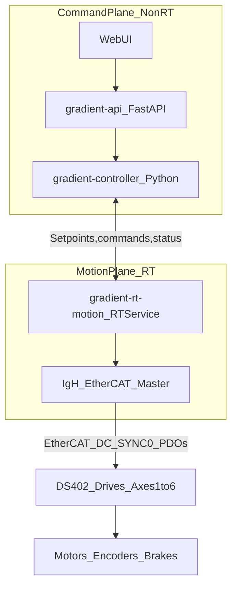

## RTOS / EtherCAT (IgH) RT Motion Core Plan

This document is the **single source of truth** for planning an industrial‑grade, appliance‑style control stack:

`RevPi (Linux + PREEMPT_RT) → IgH EtherCAT master (DC/SYNC0) → DS402 drives (A6‑EC initially) → motors+encoders+brakes`

The goal is to be **robust for multi‑year uptime**, swappable across different DS402 EtherCAT drives (StepperOnline now, Beckhoff later), and compatible with the existing GradientOS “robot config + backend” architecture.

For a high-level overview + implementation checklist designed for a fresh AI/engineer, start with:
- `RTOS-ETHERCAT-PLAN/Plan overview & to-do.md`

---

## 0) Goals / Non‑Goals

### Goals
- **Deterministic cyclic control** suitable for industrial robotics:
  - 1 kHz nominal cycle (1 ms), with DC/SYNC0 and bounded jitter.
  - Stable EtherCAT OP state + health monitoring.
- **Separation of concerns**:
  - Python (GradientOS) stays “command plane” (API/UI/planning/trajectory generation).
  - RT motion core owns “motion plane” (EtherCAT/DC/DS402/brakes/safety gating).
- **Drive‑swappable** architecture:
  - Keep drive‑specific behavior in a “drive profile” layer.
  - A generic DS402 axis abstraction above that.
- **Safe behavior with brakes**:
  - A6‑EC brakes are spring‑applied, power‑released with timing constraints.
  - Enforce “no motion until brake released + delay satisfied”.
- **Appliance deployment**:
  - Freeze kernel + IgH + RT core versions in a validated image.
  - Controlled updates, rollback, bounded logs, watchdog.

### Non‑Goals (for initial bring‑up)
- Full 6‑axis kinematics/IK planning for the new arm (later).
- Advanced motion features (blending, jerk‑limited profiles, collision checking) beyond setpoint streaming.
- EtherCAT safety (FSoE) as a first milestone (optional future).

---

## 1) Key Facts From A6‑EC Manual (constraints we must honor)

### EtherCAT / DS402 / DC
- Drives are **CiA402 (DS402) over CoE** and support **DC (distributed clocks)**.
- DC is **SYNC0‑based** (drive “only supports DC sync mode”).

### PDO mapping is not persistent
- PDO mapping must be configured in **Pre‑Operational** and **is not stored in EEPROM** (must reconfigure after every power‑on).

### Brake behavior
- Brake is **holding/parking**, not a dynamic brake:
  - The brake is not used as part of the servo control loop.
  - The brake should only be applied when the motor is stopped (manual caution: do not use it to brake a moving load).
- Design intent for the robot:
  - While the arm is “engaged/armed” and tracking setpoints, the **servo provides holding torque** and the **brake remains released**.
  - The brake’s job is **parking/safety**: hold axes when drives are disabled (disarm/E‑stop/power-loss/maintenance).
- Drive provides a **BK (brake output)** signal and the manual defines timing constraints and parameters:
  - For motors with brakes, configure a DO output as the **brake output**:
    - DO3 is used by default; configure via **C04.34 (DO3 function selection)** = **9 (Brake output)** and set logic via **C04.35 (DO3 logic selection)**.
  - **C05.13** “Delay from brake on to command received” *(default 100 ms)*:
    - After BK changes **OFF → ON** (brake releasing), do **not** input position/speed/torque references until this delay elapses.
  - **C05.10** “Delay from brake close to motor de‑energized” *(default 100 ms)*:
    - After BK changes **ON → OFF** (brake applying), the drive can keep the motor energized for this window to prevent gravity/backdrive motion.
  - For “motor rotating” stops, brake timing is governed by:
    - **C05.11** speed threshold at brake closing *(default 30 rpm)*,
    - **C05.12** maximum waiting time with S‑ON off at brake closing *(default 100 ms)*,
    - and the stop ramp behavior (referenced by the manual as “Stop according to ramp in 6085h”).
    - Interpretation: when disabling while rotating, the drive will delay applying the brake until speed is ≤ **C05.11**, but it will not wait longer than **C05.12** (whichever comes first).
- **Wiring requirement (critical):** brake power is an external DC supply (24 V DC typical). The drive’s DO3 “BK” output controls a brake relay/contactor; the manual states:
  - “The DC power supply for the brake must be prepared by users.”
  - DO outputs are optocoupler outputs (max 30 VDC / 50 mA) → drive a relay/contactor stage, not the brake coil directly.
  - Ensure ≥ 21.6 V at the brake coil (account for cable drop).

### CN1 user control terminal (DI/DO) — planned usage
From the CN1 pinout (manual + your screenshot), the following signals are available:
- **Digital inputs**
  - DI1 (pin 10): Positive limit switch
  - DI2 (pin 9): Negative limit switch
  - DI3 (pin 8): Home switch
  - DI4 (pin 7): Probe 2 (optional)
  - DI5 (pin 11): Probe 1 (optional)
  - COM+ (pin 13) / COM- (pin 14): DI commons
  - +24V (pin 15): internal 24V aux supply (20–28V, max 200 mA) — suitable for DI circuits, **not** brake coils
- **Digital outputs**
  - DO1 (pins 1/6): Servo ready
  - DO2 (pins 3/2): Fault
  - DO3 (pins 5/4): Brake (BK output)

Planned integration:
- Wire limit switches to DI1/DI2 and configure drive inputs as overtravel protection (P‑OT / N‑OT).
- Read DI status over EtherCAT using TxPDO object **0x60FD (DI status)** (already included in A6‑EC fixed TPDO sets), so RTCore can:
  - enforce software stops in addition to drive-level overtravel protection,
  - surface clean telemetry (“limit hit” events) to the UI/API.
- Use DO1/DO2 optionally for cabinet-level signaling (stacklight/safety PLC), independent of EtherCAT.

---

## 2) Architecture Overview (high level)

### Component diagram



### Responsibility split (hard rule)
- **RT motion core**:
  - EtherCAT bus state machine (Init/Pre‑Op/Safe‑Op/Op).
  - DC sync and cyclic PDO exchange at fixed period.
  - DS402 axis state machines (enable/disable/quick‑stop/fault reset).
  - Brake sequencing and motion gating.
  - Watchdog + safe reaction on comms loss, bus faults, stale setpoints.
  - Provide a stable interface to non‑RT software.

- **GradientOS Python controller**:
  - Produces arm joint setpoints (J1..J6) in **radians** at a lower rate (e.g., 50–250 Hz) or as segments.
  - External axes (E1..E3) and tool axes (gripper/end-effector) are supported by RTCore, but are commanded either:
    - via additional axis coordinates \(q\) in their configured units (future planning), or
    - via explicit per-axis commands (initial bring-up).
  - Streams setpoints / trajectories to RT core.
  - Provides UI/API endpoints and telemetry aggregation.
  - Must never be in the 1 kHz critical path.

---

## 3) Technology choices (locked in)
- EtherCAT master: **IgH** (kernel master + `libecrt`).
- Sync: **DC/SYNC0** (required by A6‑EC).
- Drive control mode: **CSP** (6060 = 8) for initial motion bring‑up.
- Deployment target: **RevPi as an appliance** (frozen kernel/master + controlled updates).

---

## 4) Real-Time Motion Core (RTCore) Design

### 4.1 Process model (threads, priorities, CPU isolation)

**Goal:** emulate the TwinCAT/Beckhoff split: dedicate cores to RT + EtherCAT.

#### CPU model (example for 4-core RevPi)
- CPU0–CPU1: housekeeping (Linux, systemd, Python, API, logs)
- CPU2–CPU3: RT domain
  - CPU2: EtherCAT cyclic thread (hard RT)
  - CPU3: axis supervision/state machines + diagnostics aggregation (near RT)

#### Thread roles
- **CyclicThread (SCHED_FIFO, highest priority)**
  - Wakes on cycle period.
  - Calls `ecrt_master_receive()` / `ecrt_domain_process()`.
  - Updates per-axis feedback snapshot.
  - Computes/encodes next outputs (controlword, target position, etc.).
  - Calls `ecrt_domain_queue()` / `ecrt_master_send()`.
  - Records timing stats (jitter, overruns).

- **SupervisorThread (SCHED_FIFO but lower than cyclic)**
  - Runs DS402 state transitions (enable, fault reset, quick stop policy).
  - Enforces brake gating and “motion allowed” conditions.
  - Handles topology verification and recovery actions.
  - Consumes commands from the non‑RT side and applies them safely.

- **IPCThread (SCHED_OTHER)**
  - Handles comms with PythonController (shared memory + eventfd or unix socket).
  - Must not block or allocate in the cyclic path.

**Hard rules for RT code:**
- No dynamic allocation in cyclic path.
- No blocking syscalls in cyclic path.
- `mlockall(MCL_CURRENT|MCL_FUTURE)` early.
- Pre-fault/initialize all memory, ring buffers, domain pointers.

### 4.2 EtherCAT master lifecycle (IgH)

#### Startup state machine
1. Load IgH kernel modules (ensure NIC is dedicated).
2. `ecrt_request_master()`.
3. Create one or more domains (process data).
4. Configure slaves:
   - Verify vendor/product IDs.
   - Configure sync managers and PDOs (A6‑EC: choose fixed mapping set).
   - Configure DC for each slave (sync0 period/phase).
5. Activate master.
6. Transition to OP:
   - Validate WKC expected vs actual.
   - Validate all slaves in OP.
7. Enter cyclic operation.

#### Topology invariants (appliance behavior)
- In production mode:
  - If a slave is missing/wrong ID/order: **refuse to arm**.
  - Do not “silently” accept topology drift.

### 4.3 Drive profile layer (vendor/drive-specific)

This layer is **the only place** that knows details specific to A6‑EC or Beckhoff, etc.

Responsibilities:
- Select default PDO mapping (A6‑EC supports fixed sets like 1702h/1B02h).
- Apply any mandatory SDO configuration at startup (if needed).
- Interpret fault/status extras if vendor-specific.
- Expose a consistent set of process variables to the DS402 axis abstraction.

### 4.4 Generic DS402 axis abstraction (drive-agnostic)

#### Required objects (minimum set)
- `0x6040` Controlword (RxPDO)
- `0x6041` Statusword (TxPDO)
- `0x6060` Modes of operation (RxPDO) — set to CSP=8
- `0x6061` Modes display (TxPDO)
- `0x607A` Target position (RxPDO)
- `0x6064` Position actual value (TxPDO)
- `0x603F` Fault code (TxPDO)

Optional but recommended early:
- `0x606C` Actual velocity
- `0x6077` Actual torque
- `0x60F4` Following error

#### DS402 state handling
Implement a deterministic sequence using statusword decoding:
- Fault reset as edge on controlword bit 7 when in fault.
- Enable sequence: “→ 6 → 7 → 15” (as described in the manual examples).
- Quick stop policy: explicitly command quick stop on watchdog/bus fault.

### 4.5 Brake sequencing (safety gating)

We must support:
- Brakes are **power‑released** (24 V coil).
- Drive provides **BK output** (hardware wiring).
- Manual imposes **delay windows** after brake state changes and describes behavior keyed off the **servo enable (S‑ON)** signal:
  - In our architecture, “S‑ON” should be treated as “axis is enabled / drive is permitted to energize” (implemented via DS402 enable/disable).

#### Proposed brake policy
- Treat brakes as part of the axis “permission to move”.
- The RT core must enforce:
  - Only allow setpoint changes when:
    - DS402 is Operation Enabled,
    - Brake is released and the configured post‑release delay has elapsed (**C05.13**),
    - Setpoints are fresh.
- On stop/fault/stale setpoints:
  - Command quick stop / controlled stop.
  - Ensure drive transitions to safe torque state.
  - Brake engages via wiring/drive control.
  - Keep “hold torque” for gravity axes as configured.

#### Configurable timing knobs
Express these in a drive‑agnostic axis config:
- `has_brake: bool`
- `brake_release_delay_s` (maps to **C05.13** “Delay from brake on to command received”; default **0.100 s**)
- `brake_hold_delay_s` (maps to **C05.10** “Delay from brake close to motor de‑energized”; default **0.100 s**)
- `brake_close_speed_threshold_rpm` (maps to **C05.11**; default **30 rpm**) *(optional; relevant for rotating stops)*
- `brake_close_max_wait_ms` (maps to **C05.12**; default **100 ms**) *(optional; relevant for rotating stops)*
- `is_gravity_axis: bool` (enables conservative stop policy)

Notes:
- The drive itself sequences BK output + motor energization according to these parameters (see manual brake timing figures).
- RTCore’s job is to **not fight** the drive timing:
  - After enabling (S‑ON/DS402 enable), wait `brake_release_delay_s` before applying setpoint changes.
  - After disabling (S‑ON/DS402 disable), assume the drive may keep torque on for `brake_hold_delay_s` to prevent gravity/backdrive motion.

#### 4.5.1 Brake wiring (A6‑EC reference implementation)
Planned wiring for each axis brake should follow the manual’s “Figure 3‑7 Wiring of the brake” conceptually:
- Provide a dedicated **24 V DC brake supply** (sized for the sum of brake watts + margin).
- Use drive **DO3 BK+ / BK‑** to control a **brake relay (BK‑RY)** / “electromagnetic contactor” stage.
- Brake coil polarity is not important.
- Enforce minimum brake coil voltage (≥ 21.6 V at the motor, after cable drop).
- In RTCore logic, treat brake state + delays as part of the axis “motion permission” gate (independent of how the coil is wired).

### 4.6 Watchdogs and fault handling

#### Watchdog inputs
- **Setpoint freshness** (time since last valid target from Python side).
- **EtherCAT health**:
  - Master state (OP/SAFEOP)
  - WKC mismatch
  - Slave state transitions
  - DC sync drift beyond threshold

#### Watchdog outputs (policy)
- On stale setpoints:
  - Quick stop, then disable, then brake engage.
- On EtherCAT leaving OP:
  - Immediate safe state, brake engage.
- On per-axis fault:
  - Remove motion permission for that axis.
  - Report fault code upstream.

### 4.7 Diagnostics and logging (industrial)
- RT-safe ring buffer for last N events (state transitions, faults, WKC changes).
- Jitter statistics:
  - min/avg/max, percentiles, overrun count.
- “Support bundle” output for field debugging (versions, topology, faults).

---

## 5) Interface Between GradientOS and RTCore

### 5.1 Transport choice
Preferred for determinism:
- Shared memory ring buffers + eventfd (low overhead, no kernel networking).
Fallback for simplicity:
- Unix domain socket with fixed-size messages.

### 5.2 Command plane API (logical operations)
RTCore should expose:
- `system_status()` (OP state, version, uptime, jitter stats)
- `axis_status(i)` (DS402 state, fault code, brake state, actual pos)
- `arm(enable=True|False)` (global arm/disarm)
- `axis_enable(i)` / `axis_disable(i)`
- `fault_reset(i|all)`
- `set_mode(i, CSP|CSV|CST)` (initially CSP only)
- `send_setpoints(q[num_axes], target_time_ns, axis_mask, flags)` OR buffered segment interface

### 5.3 Setpoint streaming contract (CSP)
Define exactly:
- Expected update rate from Python (e.g. 100–250 Hz).
- Interpolation inside RTCore to 1 kHz:
  - Minimum: hold-last-sample.
  - Better: linear interpolation with time tags.
  - Future: jerk-limited segments.
- Stale threshold (e.g. 50 ms) triggers watchdog.

### 5.4 Units and scaling
Python speaks radians. RTCore converts to counts:
- `counts = home_offset_counts + sign * round(q * counts_per_unit)`
- `counts_per_unit` depends on axis type:
  - rotary: `counts_per_unit = counts_per_rev * gear_ratio / (2π)` (counts per rad)
  - linear (rail): `counts_per_unit = counts_per_rev * gear_ratio / lead_m_per_rev` (counts per meter)

Where `counts_per_rev` is typically 131072 for 17-bit encoders (verify whether electronic gearing changes this).

---

## 6) Configuration Model (drive-swappable)

### 6.1 Two config layers
- Robot/axis mechanics config (gear ratios, signs, offsets, limits, brake semantics).
- Drive profile config (PDO choice, SDO init parameters, vendor/product IDs).

### 6.2 Example axis config fields
- `axis_index` (0..num_axes-1)
- `ethercat`:
  - `alias` / `position` (station addressing)
  - `vendor_id`, `product_id`
  - `pdo_set` (e.g. `A6EC_fixed_1702_1B02`)
- `scaling`:
  - `counts_per_rev`
  - `gear_ratio`
  - `sign`
  - `home_offset_counts`
- `limits`:
  - `min_q`, `max_q` (axis units: rad for rotary, m for linear, etc.)
  - `max_vel_q_s` (optional; units: rad/s or m/s)
  - `max_torque` (optional)
- `brake`:
  - `has_brake`
  - `is_gravity_axis`
  - `release_delay_s`
  - `hold_delay_s`

---

## 7) Integration points in existing GradientOS codebase

### 7.1 Existing seams to reuse
- `RobotConfig` already describes logical joints and mapping:
  - `actuator_ids`
  - `logical_to_physical_map`
  - `logical_joint_limits_rad`

### 7.2 New backend (planned; do not implement yet)
- Add a new backend (conceptually `backends/ethercat`) implementing `ActuatorBackend`, but acting as a proxy to RTCore.
- It should:
  - convert rad ↔ counts where appropriate (or delegate to RTCore consistently),
  - provide `get_joint_positions()`, `set_joint_positions()`,
  - provide batch methods but never try to do 1 kHz bus work.

### 7.3 STOP semantics
- Existing STOP command should translate to RTCore “quick stop now”:
  - ensures DS402 quick stop,
  - ensures brake engage policy,
  - reports “stopped” reliably.

### 7.4 Repository layout for EtherCAT assets (ESI + wiring references)

We will keep vendor ESI XMLs and wiring reference material in-repo for repeatable bring-up and long-term maintenance.

Planned tree:

```
docs/resources/ethercat/
  esi/
    README.md
    stepperonline/
      A6-EC/
        <place vendor ESI XML(s) here>
    beckhoff/
      <place Beckhoff ESI files here later>
  wiring/
    README.md
    a6-ec_cn1_pinout.png (optional)
```

Notes:
- ESI XMLs should be committed **as-is** (no edits) and versioned alongside the RTCore code/config that depends on them.
- If any ESI distribution license prevents committing them, we will instead store them locally and commit only extracted metadata (vendor/product IDs + PDO layouts) in a documented format.

---

## 8) Development Phases (milestone plan)

### Phase 0 — Host/RT prerequisites
- PREEMPT_RT kernel strategy for RevPi (exact kernel/version pinned).
- Install/build IgH master for that kernel.
- Dedicate NIC for EtherCAT and lock networking config.
- Create systemd services scaffolding (RTCore service later).

### Phase 1 — EtherCAT bring-up (no motion)
- Discover slaves, verify vendor/product IDs.
- Capture the A6‑EC ESI XMLs in-repo and extract:
  - vendor_id / product_id, supported PDO sets, DC capabilities
  - then cross-check against live scan (SII/CoE) on real hardware
- Transition bus to OP reliably.
- Configure DC and verify sync stability.
- Configure PDO assignment every boot (Pre‑Op requirement; mapping is not persisted on A6‑EC).
- Confirm TxPDO reads are sane (statusword/position/faultcode).

### Phase 2 — DS402 control (still “hold”)
- Implement DS402 state machine transitions:
  - fault reset handling,
  - enable sequence,
  - quick stop.
- Set CSP mode (6060=8), hold target position constant.
- Verify stable “enabled + holding” behavior.

### Phase 3 — Brake integration
- Wire BK output to brake coil power path (hardware).
- Implement brake gating:
  - do not accept motion setpoints until delay satisfied.
- Validate vertical axis behavior (no droop).
- Validate comms loss → safe stop → brake engage.

### Phase 4 — Python integration (streaming)
- Implement RTCore IPC transport.
- Implement Python-side client and a GradientOS backend shim.
- Start with simple “hold last” setpoint updates.
- Validate end-to-end STOP and status reporting.

### Phase 5 — Appliance hardening
- CPU isolation + IRQ affinity pinned in boot config.
- Freeze Ethernet interface naming (MAC-based `ethercat0` / `uplink0`) and lock EtherCAT NIC to “no IP / no NetworkManager”.
- Add watchdog + auto-restart behavior.
- Add bounded logging + support bundle.
- Freeze kernel/master/core versions and document upgrade procedure.

---

## 9) Test Plan (what we must prove before “freeze”)

### Functional
- Bus reaches OP on cold boot.
- DS402 enable/disable works for all axes.
- Fault injection:
  - unplug slave cable,
  - power-cycle a drive,
  - forced fault (following error) if safely possible.
- Brake tests:
  - enable/disable sequences,
  - confirm “no motion until brake released + delay”.

### Real-time performance
- Cycle jitter statistics under load (API/UI active).
- Overrun count = 0 in sustained 1 kHz operation (target).
- DC sync drift bounded.

### Safety behavior
- Stale setpoint watchdog triggers safe stop.
- Emergency stop input behavior (if present).
- Power loss behavior (brake engages mechanically).

---

## 10) Appliance “freeze” policy

### Frozen items
- Kernel version + RT config
- IgH master version + modules
- NIC model/driver + EtherCAT wiring
- RTCore binary version
- Known-good drive profile for A6‑EC

### Update workflow (post-freeze)
- Only update via validated release images.
- Prefer A/B partition with rollback on failure.
- No unattended upgrades.

---

## 11) Open Questions (facts needed to finalize details)

### Hardware / platform
- **RevPi platform:** RevPi Connect 5 (Compute Module 5 / BCM2712 Cortex‑A76), **4 cores** (CPU0–CPU3), 2.4 GHz, 8 GB RAM, 32 GB eMMC.
- **Ethernet:** 2 × RJ45 Gbit Ethernet; Linux names typically **`eth0`** and **`eth1`**.
  - Plan: dedicate **one** port exclusively for EtherCAT (no IP, no NetworkManager), and keep the other for normal networking (SSH/API/UI).
  - Appliance hardening step: freeze interface naming using MAC-based rules (e.g. rename to `ethercat0` and `uplink0`) to prevent surprises if Linux reorders `eth0`/`eth1`.
  - Recorded MACs / assignment:
    - `uplink0` (currently `eth1`, has IP): `c8:3e:a7:14:1c:76`
    - `ethercat0` (currently `eth0`, dedicated EtherCAT): `c8:3e:a7:14:1c:75`
    - PiBridge NICs (not used for motion): `pileft` `c8:3e:a7:14:1c:77`, `piright` `c8:3e:a7:14:1c:78`
- **Watchdog:** `/dev/watchdog0` (CPU watchdog) and `/dev/watchdog1` (RTC watchdog) exist. Plan to enable systemd watchdog + hardware watchdog for RTCore.
- Is there a hard E‑stop loop and/or STO wiring planned?

### Drive / topology
- **Initial chain:** 6 servo drives (Axes 1–6). Confirm whether any additional EtherCAT devices will be on the same bus (I/O modules, safety, gripper, etc.).
- **ESI XML (StepperOnline A6 family):** `docs/resources/ethercat/esi/stepperonline/A6-EC/STEPPERONLINE_A6_Servo_V0.02.xml`
  - Defines **one** EtherCAT slave type (one `<Device>` entry): “A6N Servo Driver”.
  - Vendor ID: `0x00400000` (STEPPERONLINE)
  - ProductCode: `0x00000715`
  - RevisionNo: `0x00002EF8`
  - Action item: verify the connected drives report the same Vendor/Product/Revision via a live scan (SII/CoE). If any differ, we add a second drive-profile entry.
  - Note: the ESI describes the **EtherCAT slave interface** (drive/controller), not the motor’s **power rating**. So it’s expected that 400 W / 750 W / 1 kW variants can share the same Vendor/Product/Revision; power/torque/current limits are handled via drive parameters + axis configuration, not via a different ESI.
- **Planned initial PDO set (A6‑EC):** fixed mapping **`1702h / 1B02h`** (includes 6040/607A/6060 + status/pos/fault/mode display). We will still configure the assignment objects in Pre‑Op every boot.
  - Extracted from the ESI (authoritative) for **A6‑EC/A6N**:
    - **RxPDO `0x1702` (Outputs, 19 bytes)**:
      1. `0x6040:00` Controlword (16b)
      2. `0x607A:00` Target position (32b)
      3. `0x60FF:00` Target velocity (32b) *(unused in CSP, but harmless to map)*
      4. `0x6071:00` Target torque (16b) *(unused in CSP, but harmless to map)*
      5. `0x6060:00` Modes of operation (8b) *(set to CSP=8)*
      6. `0x60B8:00` Touch probe function (16b) *(optional)*
      7. `0x607F:00` Max profile velocity (32b) *(profile modes; optional)*
    - **TxPDO `0x1B02` (Inputs, 25 bytes)**:
      1. `0x603F:00` Error code (16b)
      2. `0x6041:00` Statusword (16b)
      3. `0x6064:00` Position actual value (32b)
      4. `0x6077:00` Torque actual value (16b)
      5. `0x6061:00` Modes of operation display (8b)
      6. `0x60B9:00` Touch probe status (16b) *(optional)*
      7. `0x60BA:00` Touch probe pos1 pos value (32b) *(optional)*
      8. `0x60BC:00` Touch probe pos2 pos value (32b) *(optional)*
      9. `0x60FD:00` Digital inputs (32b) *(DI1..DI5 etc; used for limits/telemetry)*
  - Note: the mapping is byte-aligned (all entries are multiples of 8 bits) → easier to implement safely in `libecrt` domains.

### Brakes
- Confirm final brake wiring choice:
  - Recommended: per-axis drive **BK output (DO3) → brake relay/contactor → external 24 V brake coil** (manual Figure 3‑7).
  - Alternative: centralized brake controller (still must respect per-axis delays and safe sequencing).
- Do you need per-axis brake delays different from defaults?

### Units / scaling
- Confirm: are the “17-bit counts” motor encoder counts presented directly in 0x6064/0x607A, or is electronic gearing applied?
- Gear ratios per joint (even rough placeholders) for configuration?
  - Provided initial mechanical ratios (assume **motor revolutions : joint revolutions**):
    - J1: **100:1**
    - J2: **100:1**
    - J3: **100:1**
    - J4: **18:1**
    - J5: **20:1**
    - J6: **10:1**
  - These will populate `axis[i].scaling.gear_ratio` and the conversion:
    - \( \text{counts\_per\_rad} = \text{counts\_per\_rev} \cdot \text{gear\_ratio} / (2\pi) \)
  - If we later discover the ratio convention is inverted (joint:motor), we flip it once here and everything remains consistent.

---

## 12) Glossary (to keep the plan readable)
- **IgH**: EtherLab EtherCAT Master (kernel + libecrt)
- **DC**: Distributed Clocks
- **SYNC0**: periodic DC sync pulse
- **RTOS**: Real‑Time Operating System (in our case: Linux with PREEMPT_RT + hard-RT scheduling for the cyclic thread)
- **PREEMPT_RT**: Linux real‑time preemption patchset / RT kernel configuration
- **SCHED_FIFO**: Linux real‑time scheduling class (fixed priority, no timeslice)
- **IRQ**: Interrupt Request (hardware interrupt) — must be pinned away from RT cores except EtherCAT IRQs
- **DS402 / CiA402**: CANopen drive profile/state machine over CoE
- **CSP/CSV/CST**: (DS402 modes) Cyclic Synchronous Position / Velocity / Torque
- **PP/PV/PT**: (DS402 modes) Profile Position / Velocity / Torque
- **CoE**: CANopen over EtherCAT (mailbox + DS402 object dictionary access)
- **PDO**: cyclic process data (RxPDO master→drive, TxPDO drive→master)
- **RxPDO / TxPDO**: Receive/Transmit PDO (slave receive = master output; slave transmit = master input)
- **SDO**: mailbox configuration (non-cyclic)
- **EoE**: Ethernet over EtherCAT (not used for motion)
- **FoE**: File over EtherCAT (firmware/file transfer; optional)
- **SoE**: Servo over EtherCAT (common on some drives; not required for DS402)
- **SII**: Slave Information Interface (EEPROM identity/config data)
- **WKC**: Working Counter — EtherCAT frame correctness/participation indicator used as a health check
- **SM/FMMU**: EtherCAT slave controller mapping mechanisms
- **ESC**: EtherCAT Slave Controller (hardware inside each slave/drive)
- **PDI**: Process Data Interface (ESC ↔ application CPU interface inside the slave)
- **BK**: brake output signal from drive
- **DI/DO**: Digital Input / Digital Output
- **STO**: Safe Torque Off (safety-rated hardware input on many drives; separate from EtherCAT)
- **E‑stop**: Emergency stop circuit (usually safety relay → STO / contactors)
- **IPC**: Inter‑Process Communication (RTCore ↔ Python controller)

---

## 13) Remaining items to flesh out (checklist)

### Host OS / RT tuning (RevPi “appliance” details)
**Objective:** make the RevPi behave like an industrial controller appliance:
- hard real‑time cyclic execution on dedicated cores,
- deterministic EtherCAT timing,
- controlled/frozen software surface area after validation (“freeze”).

#### 13.1.1 Baseline OS image (reproducible)
- Target baseline: **RevPi Bookworm** (pin a specific release image + date).
- Capture provenance in the support bundle:
  - `cat /etc/os-release`
  - `uname -a`
  - `dpkg-query -W | sort` (or at least kernel + ethercat packages)
  - `/boot/firmware/cmdline.txt` and `/boot/firmware/config.txt`
  - MAC addresses of `eth0/eth1` (for stable renaming later).
- Reproducibility goal:
  - We should be able to rebuild the appliance image from a documented recipe (even if the initial prototype is “hand configured”).

#### 13.1.2 PREEMPT_RT kernel strategy (RevPi Connect 5 / BCM2712)
- Target: Linux kernel with **PREEMPT_RT** enabled.
- Strategy options (choose one; document and then lock it):
  - **Option A (preferred if available):** use a vendor-supported RT kernel package for the RevPi Bookworm base.
    - Pros: simplest, fewer surprises.
    - Cons: may lag upstream RT fixes; availability depends on RevPi ecosystem.
  - **Option B:** build a custom RT kernel from the Raspberry Pi kernel tree + matching RT patchset.
    - Pin:
      - kernel version (e.g. `6.6.y`) and exact git commit/tag,
      - RT patch version (`-rtXX`),
      - kernel `.config` file committed in-repo (or stored in release artifacts).
    - Build outputs to pin:
      - `vmlinuz`, modules, device tree blobs, and the exact firmware set.
- Post-freeze policy:
  - **Disable unattended upgrades**.
  - Explicitly **hold** kernel + firmware packages (or remove the package manager path entirely for field units).
  - Updates only via a validated release image (see “freeze policy” section).

#### 13.1.3 Boot-time kernel parameters (CPU isolation + tick + RCU)
Goal: dedicate **CPU2–CPU3** to RT cyclic work and keep OS “noise” on CPU0–CPU1.

- Candidate baseline kernel cmdline (finalize during tuning):
  - `isolcpus=2,3 nohz_full=2,3 rcu_nocbs=2,3 irqaffinity=0,1`
  - Notes:
    - `irqaffinity=0,1` pushes **all** IRQs to housekeeping by default; we then explicitly move EtherCAT NIC IRQs to RT CPUs.
    - With `nohz_full`, only run the RT threads on isolated CPUs (no random user tasks).
    - If these parameters cause unexpected behavior, we can start simpler (only `isolcpus` + IRQ pinning) and add `nohz_full` later.

#### 13.1.4 IRQ affinity + interrupt thread priority (critical)
- **Disable irqbalance** in production (it will fight our pinning).
- Pinning approach:
  1. Default all IRQs → CPU0–CPU1 via `irqaffinity=0,1`.
  2. Identify EtherCAT NIC IRQ(s) at runtime (e.g., `grep ethercat0 /proc/interrupts`).
  3. Move EtherCAT IRQ(s) to **CPU2–CPU3** (mask `0xC` on a 4‑core system).
  4. On PREEMPT_RT, IRQs run as threads (`irq/<n>-<name>`): raise priority of EtherCAT IRQ thread(s) just below the cyclic thread.
- Implementation detail (for later): deliver as a small boot-time script + systemd unit that runs before RTCore starts.

#### 13.1.5 CPU governor / thermals / power behavior
- Set CPU freq governor to **performance** (do not allow ondemand scaling to inject jitter).
- Define thermal policy:
  - monitor CPU temp + throttling flags,
  - if throttling occurs during motion: raise an alarm and (policy decision) either:
    - degrade cycle time, or
    - trigger a controlled stop (industrial-conservative choice).
- Mechanical considerations:
  - cabinet airflow, dust, ambient temp (-25…+60°C per RevPi spec),
  - keep margin to avoid thermal throttling during sustained 1 kHz loops.

#### 13.1.6 RTCore service model (systemd hardening template)
RTCore should be treated like a PLC task: auto-start, auto-restart, constrained resources, and watchdog-supervised.

- systemd goals:
  - pin RTCore to CPU2–CPU3,
  - run cyclic threads with `SCHED_FIFO` and high priority,
  - allow memory locking,
  - restart on failure with bounded restart storm behavior,
  - expose a watchdog heartbeat.

- Example unit properties to include (final values tuned later):
  - `CPUAffinity=2 3` / `AllowedCPUs=2 3`
  - `CPUSchedulingPolicy=fifo`
  - `CPUSchedulingPriority=90` (keep headroom above/below for IRQ threads)
  - `LimitRTPRIO=95`, `LimitMEMLOCK=infinity`, `LimitNOFILE=1048576`
  - capabilities: `CAP_SYS_NICE`, `CAP_IPC_LOCK`
  - `Restart=always`, `RestartSec=1`
  - `WatchdogSec=2` (RTCore must heartbeat)
  - hardening: `NoNewPrivileges=yes`, `ProtectSystem=strict`, etc. (ensure it doesn’t block required device access)

#### 13.1.7 Watchdogs (multi-layer)
We want safety + recovery:
- **Drive-level watchdog** (EtherCAT/PDO timeout) should force a safe stop if cyclic frames stop.
- **RTCore internal watchdogs** (stale setpoints, WKC mismatch, DC drift) trigger quick stop / disable / brake policy.
- **systemd watchdog** restarts RTCore if it stops heartbeating.
- **hardware watchdog** reboots the whole RevPi if the OS is stuck (last resort).

#### 13.1.8 Verification checklist (must pass before “freeze”)
- Run RT latency tools:
  - `cyclictest` and/or `rtla timerlat/oslat` while stressing CPU/network/disk on housekeeping cores.
- Verify CPU/IRQ pinning:
  - RTCore threads always on CPU2–CPU3,
  - EtherCAT NIC IRQs on CPU2–CPU3,
  - uplink/network/UI IRQs on CPU0–CPU1.
- Verify no thermal throttling in worst-case cabinet conditions (or document required cooling).
- Record jitter/overrun stats as part of the “support bundle” for the validated build.

### Network/NIC hardening (EtherCAT port)
**Objective:** make EtherCAT networking deterministic and immune to “normal Linux networking” side effects.

#### 13.2.1 Deterministic interface naming (`ethercat0` / `uplink0`)
- Record MAC addresses and bind them to stable names:
  - `uplink0` (currently `eth1`, has IP): `c8:3e:a7:14:1c:76`
  - `ethercat0` (currently `eth0`, EtherCAT): `c8:3e:a7:14:1c:75`
  - PiBridge NICs (not used for motion): `pileft` `c8:3e:a7:14:1c:77`, `piright` `c8:3e:a7:14:1c:78`
- Preferred approach: `systemd.link` files (simple, robust):
  - `/etc/systemd/network/10-ethercat0.link`:
    - Match by MAC → rename to `ethercat0`
  - `/etc/systemd/network/10-uplink0.link`:
    - Match by MAC → rename to `uplink0`
- Rationale: avoids surprises if Linux ever swaps `eth0`/`eth1` enumeration.

#### 13.2.2 Ensure `ethercat0` is not managed like a normal NIC
- Requirements for the EtherCAT port:
  - **No IP address**, **no DHCP**, **no routing**, **no firewall/NAT rules**, **no bridge**, **no VLAN**.
  - It should exist purely as a raw Ethernet interface for EtherCAT frames (ethertype `0x88A4`).
- RevPi Bookworm typically uses **NetworkManager** (via Cockpit):
  - Mark `ethercat0` as **unmanaged** using a drop-in config, e.g.:
    - `/etc/NetworkManager/conf.d/10-unmanaged-ethercat.conf`
      - `[keyfile] unmanaged-devices=interface-name:ethercat0`
  - Keep `uplink0` under NetworkManager for SSH/API/UI.
- Ensure `ethercat0` is still brought **UP** at boot (link up, no IP):
  - `ip link set ethercat0 up` (done by the EtherCAT master service or a small pre-start unit).

#### 13.2.3 NIC driver/offload/EEE settings (tuning for determinism)
EtherCAT is sensitive to jitter; some NIC features can add latency.

- Validate link parameters:
  - Most EtherCAT slaves run **100 Mbps full duplex** (not 1 Gbps).
  - Verify actual negotiated speed/duplex via `ethtool ethercat0`.
  - If negotiation causes instability, consider forcing: `100/full` (only if proven stable).
- Consider disabling features on `ethercat0` (final list decided empirically):
  - GRO/LRO/GSO/TSO offloads: `ethtool -K ethercat0 gro off gso off tso off lro off`
  - Energy Efficient Ethernet (EEE): `ethtool --set-eee ethercat0 eee off`
- Always document the final chosen `ethtool` settings in the plan + support bundle.

#### 13.2.4 Physical wiring rules (industrial hygiene)
- EtherCAT segment should be **electrically isolated** from normal Ethernet:
  - No switches/routers between master and first slave.
  - No “shared cabinet patch panel” that could accidentally connect it to LAN.
- Use shielded industrial Ethernet cables where possible; define shield grounding rules (cabinet earth).
- Topology:
  - Master `ethercat0` → Drive 1 IN → Drive 1 OUT → … → Drive 6 OUT (line topology).
  - Terminate the chain per vendor guidance (EtherCAT does not use classic termination resistors like RS485).

### IgH master configuration (exact files + service model)
**Objective:** make the EtherCAT master setup reproducible, debuggable, and “locked” for production.

#### 13.3.1 What “IgH master” means in our stack
- The IgH master is primarily:
  - a **kernel master module** (`ec_master`) + NIC binding module (typically `ec_generic`),
  - plus a user-space API: **`libecrt`** (used by RTCore).
- RTCore owns the bus configuration and cyclic PDO loop via `libecrt`.
- There is no separate motion daemon; RTCore is the motion brain.

#### 13.3.2 Version pinning (appliance requirement)
- Pin:
  - IgH source version/commit,
  - kernel version/build it was compiled against,
  - the exact build flags/config.
- Packaging choice:
  - Prefer a **prebuilt artifact** baked into the release image for production.
  - During development, on-target builds are acceptable but must be captured in provenance.

#### 13.3.3 Kernel modules required (typical)
- `ec_master` (the EtherCAT master core)
- `ec_generic` (generic EtherCAT device driver; binds to `ethercat0`)
- Optional: NIC-specific EtherCAT drivers if `ec_generic` is insufficient (rare; prefer generic first).
- Production constraint:
  - Only bind the master to **`ethercat0`** (dedicated port), never to the uplink NIC.

#### 13.3.4 Master configuration file(s)
IgH commonly uses `/etc/ethercat.conf` to define which NIC to bind.

- Contents we will lock down (example shape; final values are MAC-based):
  - `MASTER0_DEVICE` = MAC address of `ethercat0` (preferred) or stable interface name
  - `DEVICE_MODULES` = `generic`
- Rationale: binding by **MAC** is more robust than by `eth0/eth1`.

#### 13.3.5 systemd service ordering (master before RTCore)
- Bring-up order:
  1. rename NICs (`ethercat0/uplink0`)
  2. ensure `ethercat0` is UP (no IP)
  3. load IgH modules / bind master to `ethercat0`
  4. start RTCore
- systemd rule:
  - `gradient-rt-motion.service` **Requires/After** `ethercat.service`
  - if `ethercat.service` fails → RTCore must not start.

#### 13.3.6 Topology capture + validation (bring-up vs production)
We maintain a strict expected topology:
- Number of slaves (initially 6)
- Order / station position in the chain
- VendorId/ProductCode/RevisionNo for each

Bring-up tools (IgH CLI) used to capture ground truth:
- `ethercat master`
- `ethercat slaves -v` (IDs, positions, states)
- `ethercat pdos` (PDO layout; cross-check vs ESI)
- `ethercat dc` (DC sync diagnostics)
- `ethercat sii_read` (identity/topology evidence)

Production validation policy:
- If **any** slave identity/order differs from the expected config: **refuse to arm** (no motion permission).
- If a slave is missing: stay disarmed, raise alarm.
- If a slave is present but not in OP: attempt bounded recovery (limited retries), then disarm.

#### 13.3.7 “Production mode” recovery behavior (define now)
We must decide how aggressive auto-recovery should be:
- **Conservative (industrial default):**
  - attempt N retries to re-enter OP,
  - if it fails → disarm and require operator intervention.
- **Aggressive (development-friendly):**
  - keep trying forever to re-enter OP.

Plan: development uses aggressive mode; production uses conservative mode (N retries + latched fault).

### DC/SYNC0 configuration details
**Objective:** ensure all drives latch setpoints simultaneously and remain phase-locked with bounded jitter.

#### 13.4.1 Nominal cycle time
- Baseline: **1.000 ms (1 kHz)** cyclic PDO exchange.
- Keep cycle time as a single configuration parameter:
  - `cycle_ns = 1_000_000`
- Development fallback if needed:
  - start at 2 ms (500 Hz) during early bring-up, then move to 1 ms once stable.

#### 13.4.2 SYNC0 vs “free-run”
- A6‑EC indicates it requires **DC sync mode** (SYNC0-based).
- Policy:
  - If DC cannot be configured or drifts beyond threshold → **disarm** (no motion permission).
  - We do not run the robot in free-run EtherCAT mode for production.

#### 13.4.3 SYNC0 phase/shift strategy (initial + tuning)
We need to choose when the slave latches outputs relative to our cycle boundaries.

- Initial conservative choice:
  - `sync0_shift_ns = 0` (align SYNC0 pulse with our application cycle boundary)
- If we observe that frames arrive “too close” to SYNC0 on a loaded system:
  - Introduce a small positive shift (e.g. 100–300 µs) so the master always has margin to deliver outputs before the latch event.
- Final shift is determined empirically using:
  - `ethercat dc` diagnostics
  - RTCore timing statistics (send time relative to scheduled wakeup)

#### 13.4.4 IgH / `libecrt` DC algorithm (what RTCore must do)
RTCore must explicitly participate in DC timekeeping (this is a common gotcha).

- In each cycle, RTCore should (conceptual order):
  1. call receive/process functions (`ecrt_master_receive`, `ecrt_domain_process`)
  2. compute outputs
  3. queue/send (`ecrt_domain_queue`, `ecrt_master_send`)
  4. provide an “application time” timestamp to the master (ns)
  5. periodically sync reference clock and slave clocks (rate chosen for stability vs overhead)
- Choose a **reference clock** slave (typically the first drive) and sync all other slaves to it.
- Document the exact sync cadence:
  - e.g. sync reference clock every N cycles (e.g. 100–1000 cycles) and sync slave clocks every cycle or every few cycles, depending on measured stability.

#### 13.4.5 DC health metrics + thresholds (define “good”)
We need objective thresholds that become acceptance criteria for “freeze”.

Metrics to record:
- **Cycle jitter** (RT thread wakeup variance):
  - min/avg/max and percentiles
  - overrun count
- **DC offset/drift** from `ethercat dc` / `libecrt`:
  - reference clock offset relative to application time
  - drift rate over time
- **WKC stability** (working counter):
  - expected WKC vs actual WKC per cycle

Suggested initial thresholds (tune once we have real measurements):
- Overruns: **0** sustained in normal operation
- Wakeup jitter: aim for **< ±50 µs** worst-case under normal load; alarm if worse
- DC drift/offset: alarm if it becomes unstable or grows without bound; safe stop if it exceeds a configured threshold (set conservatively at first).

#### 13.4.6 Bring-up procedure (DC-specific)
- Step 1: verify slaves support DC and are in expected topology.
- Step 2: configure DC (SYNC0) for each slave and activate master.
- Step 3: validate with `ethercat dc`:
  - reference clock selected and stable,
  - offsets/diffs are bounded.
- Step 4: only then allow DS402 enable + motion permission.

### Drive commissioning (what must be configured on each A6‑EC)
**Objective:** a repeatable “per-drive” checklist so every axis behaves predictably, survives power cycles, and matches our RTCore assumptions.

#### 13.5.1 Physical wiring checklist (per drive)
- **EtherCAT ports**
  - CN3 = EtherCAT **IN** (from master / previous slave)
  - CN4 = EtherCAT **OUT** (to next slave)
  - Cable: Ethernet **Cat6 (minimum) / 100BASE‑TX**, shielded recommended, length **≤ 100 m**.
  - Chain rule: connect “left‑in / right‑out” consistently for multi‑drive installs.
  - If using a redundant ring:
    - enable “EtherCAT Enhanced Link Check” and **power-cycle** for it to take effect.
- **CN1 DI/DO electrical rules**
  - DI circuits can use the drive’s internal **+24 V** (pin 15) for DI logic, but do **not** exceed its rating and do **not** use it for brake coils.
  - Do **not** mix NPN and PNP inputs in the same circuit.
  - DO outputs are optocoupler outputs:
    - max **30 VDC**, **50 mA**.
    - if driving a relay coil, install a **flywheel diode** to protect the DO output.
- **Brake wiring (motor + drive)**
  - The brake coil is in the motor power connector (BK leads) and must be powered by an **external 24 V** supply through a relay/contactor.
  - The drive provides **DO3 (BK output)** to control the brake relay (“BK‑RY”) (see manual Figure 3‑7).
  - Ensure brake coil sees **≥ 21.6 V** under load (account for cable drop).
  - Brake coil polarity is not important; the brake is **holding** only (not for dynamic braking).

#### 13.5.2 Drive parameters to set once (stored in the drive; set via panel / vendor tool)
These are “commissioning-time” settings that should persist across power cycles.

- **Servo mode / fieldbus mode**
  - **C00.00 Servo mode = 10 (EtherCAT mode)** (manual lists EtherCAT mode; default shown as 10).
- **Brake output function**
  - Configure DO3 as brake output:
    - **C04.34 (DO3 function selection) = 9 (Brake output)**
    - **C04.35 (DO3 logic selection)**: choose active low/high and keep consistent with the relay wiring.
- **Brake timing parameters (must match RTCore brake gating)**
  - **C05.10** “Delay from brake close to motor de‑energized” (default **100 ms**)
  - **C05.11** “Speed threshold at brake closing” (default **30 rpm**)
  - **C05.12** “Maximum waiting time with S‑ON off at brake closing” (default **100 ms**)
  - **C05.13** “Delay from brake on to command received” (default **100 ms**)
  - Notes:
    - The manual describes distinct sequences for “static” (<30 rpm) vs “rotating” (≥30 rpm) conditions.
    - **C05.11 is not a speed limit**; it is the threshold below which the drive is allowed to apply the brake when disabling while rotating (bounded by **C05.12**).
    - RTCore must treat C05.13 as the **minimum delay after brake release** before applying references.
    - For gravity axes, C05.10 is critical (drive may keep motor energized briefly after BK changes to prevent droop).
- **Stop/disable ramp referenced by brake sequencing**
  - The manual references a stop behavior “Stop according to ramp in **6085h**” when S‑ON goes OFF while rotating.
  - Commissioning decision: set **6085h** to a safe decel for each axis (later tuned; start conservative).
- **Stop mode objects (DS402) — must be chosen deliberately**
  - The manual documents stop behaviors via these DS402 objects:
    - **`0x605A` Quick stop option code** (examples include: coast, ramp-to-stop via 6085h, “emergency stop torque”, and whether to keep position lock vs de-energized).
    - **`0x605C` Stop mode at S‑ON OFF** (how the drive behaves when S‑ON transitions OFF).
    - **`0x605D` Stop option code** (halt/stop behavior when commanded).
    - **`0x605E` Stop mode at fault** (fault-specific stop behavior).
  - Initial conservative target (to validate on hardware):
    - Prefer **ramp-to-stop using 6085h** and keep a “holding/lock” behavior until the brake sequence completes (especially for gravity axes).
- **Scaling sanity (avoid hidden gearing)**
  - Confirm electronic gearing is not altering counts unexpectedly:
    - object dictionary references **6091.01/6091.02** (electronic gear numerator/denominator).
  - Commissioning rule: keep electronic gear **1:1** unless we deliberately standardize on a different convention; if changed, record it in axis config and support bundle.
- **Limits / inputs**
  - Confirm DI1/DI2/DI3 are configured and wired as:
    - DI1: positive limit, DI2: negative limit, DI3: home (as per CN1 table).
  - Confirm polarity/active level and whether the drive enforces overtravel internally (recommended).
  - Parameter references (I/O parameters group **C04**):
    - **DI function selection**:
      - `C04.00` (DI1 function) default **6 = Forward overtravel**
      - `C04.04` (DI2 function) default **7 = Reverse overtravel**
      - `C04.08` (DI3 function) default **5 = Home switch**
      - `C04.0C` (DI4 function) default **31 = Probe 2**
      - `C04.10` (DI5 function) default **30 = Probe 1**
      - Available DI function options include: **1 S‑ON**, **2 Fault reset**, **4 Emergency stop**, **5 Home**, **6/7 Overtravel**, **30/31 Probes**.
    - **DI logic selection**:
      - `C04.01`/`C04.05`/`C04.09`/`C04.0D`/`C04.11` for DI1..DI5 active low/high.
    - **DI filter time**:
      - `C04.02`/`C04.06`/`C04.0A`/`C04.0E`/`C04.12` (default shown as 150 × 0.01 ms).

#### 13.5.3 Settings applied by RTCore at every boot (not persistent)
These are applied on each cold boot / drive power-cycle to ensure repeatability.

- **PDO assignment (must be done in Pre‑Op; mapping not stored in EEPROM)**
  - Select fixed mapping:
    - SM2 assignment (**RxPDO**) → choose `0x1702`
    - SM3 assignment (**TxPDO**) → choose `0x1B02`
  - Ensure this occurs only in **Pre‑Operational** (manual warning).
- **DC/SYNC0**
  - Configure SYNC0 cycle/phase as per section 13.4.
- **DS402 mode + enable**
  - Set `0x6060` to **CSP (8)** and confirm `0x6061` reports the expected mode.
  - Execute DS402 enable sequence.
  - Enforce `brake_release_delay_s` (C05.13) before allowing setpoint changes.

#### 13.5.4 Commissioning evidence to capture (per drive + per validated build)
- Record:
  - drive model (e.g. A6‑400EC/A6‑750EC/A61000EC etc), motor model, brake wattage (manual Table 3‑7),
  - EtherCAT identity: VendorId/ProductCode/RevisionNo,
  - key parameters: C00.00, C05.10–C05.13, 6091.* (if relevant), 6085h (stop ramp).
- Capture bus evidence:
  - topology dump (`ethercat slaves -v`),
  - DC report (`ethercat dc`),
  - PDO report (`ethercat pdos`).

### Axis configuration (robot-specific)
**Objective:** define a robot-specific axis model (units, signs, offsets, limits) that is independent of the drive vendor, so swapping A6‑EC → Beckhoff later doesn’t rewrite kinematics.

Robot assumption (for later kinematics planning):
- Standard industrial 6‑axis geometry (J2 offset from J1 axis, spherical wrist).

#### 13.6.1 Known/measured mechanical scaling (initial)
- Motors: **magnetic encoder**, **17-bit single-turn absolute** (**multi-turn available**).
  - Plan assumption: we operate with **multi-turn enabled** where supported, so joints can legitimately rotate > 1 rev without losing absolute position (subject to joint limit policy + cable management).
  - Nominal resolution: **131072 counts/rev** at the motor.
- Gear ratios provided (assume **motor revolutions : joint revolutions**):
  - J1: 100:1
  - J2: 100:1
  - J3: 100:1
  - J4: 18:1
  - J5: 20:1
  - J6: 10:1

#### 13.6.2 Counts semantics vs electronic gear (must be verified)
The manual states:
- “Position actual value in user-defined unit (**6064h**) × Gear ratio (**6091h**) = Position actual value in encoder unit (**6063h**).”

Plan implications:
- If we keep electronic gear (6091) at **1:1**, we can treat `0x6064` and `0x607A` as **encoder-count units** directly (simplest and preferred).
- If 6091 is not 1:1, then `0x6064/0x607A` are in a **scaled user unit**, and we must incorporate 6091 into our conversion.
- Bring-up action items:
  - read/record 6091.* and validate by comparing `0x6063` vs `0x6064` (SDO reads during commissioning).
  - validate **multi-turn** behavior:
    - rotate an axis beyond one revolution (where mechanically safe) and confirm `0x6064` continues monotonically (no wrap at ±1 turn),
    - power-cycle (with encoder battery present, if required) and confirm the reported position is retained; if not retained, treat as “needs homing” on boot.

#### 13.6.3 Axis coordinate (q) ↔ counts conversion (CSP)
RTCore converts an axis coordinate \(q\) (units depend on axis type) to counts:
- \( \\text{target\\_counts} = \\text{home\\_offset\\_counts} + \\text{sign} \\cdot \\text{round}(q \\cdot \\text{counts\\_per\\_unit}) \\)
- For rotary joints (arm joints), \(q\) is in **radians** and:
  - \( \\text{counts\\_per\\_unit} = \\text{counts\\_per\\_rev} \\cdot \\text{gear\\_ratio} / (2\\pi) \\)
- For prismatic axes (rails), \(q\) is in **meters** and:
  - \( \\text{counts\\_per\\_unit} = \\text{counts\\_per\\_rev} \\cdot \\text{gear\\_ratio} / \\text{lead\\_m\\_per\\_rev} \\)

Multi-turn policy:
- For rotary joints, do **not** modulo/normalize \(q\) into \([-\\pi, \\pi]\) inside RTCore.
- Treat \(q\) as a **continuous (unwrapped)** coordinate and enforce bounds via **soft limits**.

With `counts_per_rev = 131072` and the provided gear ratios, the nominal counts/rad are:
- J1–J3 (100:1): ~2,086,076 counts/rad
- J4 (18:1): ~375,494 counts/rad
- J5 (20:1): ~417,215 counts/rad
- J6 (10:1): ~208,608 counts/rad

#### 13.6.4 Sign conventions (CW/CCW)
- Define `sign ∈ {+1, -1}` per axis such that:
  - increasing `q` results in the intended positive axis motion.
- Commissioning method:
  - jog a small +Δ command and observe whether `0x6064` increases or decreases; set `sign` accordingly.

#### 13.6.5 Zeroing / home offsets (absolute vs homing)
We need a deterministic definition of “joint zero”.

- Encoders are absolute and multi-turn capable (battery-backed where applicable); **multi-turn is the preferred operating mode**.
  - preferred approach: **one-time calibration** to determine `home_offset_counts` per axis.
  - procedure:
    - move the axis to a known mechanical reference pose,
    - read `0x6064` (and `0x6063` if needed),
    - compute/store `home_offset_counts` so that \(q=0\) maps to that pose.
  - boot behavior (goal):
    - do **not** home on every boot; trust multi-turn absolute position when it is valid (faster/safer start-up and enables multi-turn joint limits).
  - failure mode:
    - if absolute/multi-turn position is not valid/retained (e.g., missing/flat encoder battery or a drive-reported encoder fault), require a homing routine before allowing motion.
- Homing fallback:
  - use DS402 **Homing Mode (HM, 6060=6)** + DI3 “Home switch” as the sensor.
  - store the resulting home offset and then use absolute counts during normal operation.

#### 13.6.6 Joint limits (soft + hard)
- **Hard limits**: physical stops + limit switches (DI1/DI2) wired to the drive.
- **Soft limits**: enforced by RTCore in axis units (rad for rotary joints, meters for linear axes) and optionally mirrored in the drive’s software limits.
- Commissioning method:
  - determine safe min/max joint angles (rad) and store them in config,
  - decide which joints are allowed to be **multi-turn** (common: spherical wrist joints) and set limits accordingly (still bounded; avoid cable twist and integer overflow),
  - keep soft limits inside the physical stop envelope,
  - treat limit switches as last-resort hardware protection, not routine motion bounds.

#### 13.6.7 Gravity axis policy (brakes + conservative stopping)
- Mark axes that can backdrive under gravity as `is_gravity_axis: true`.
- Initial assumption (to validate): likely at least the shoulder/elbow class joints (commonly J2/J3) are gravity axes.
- Validation method:
  - with servo disabled and brake controlled per design, verify whether the joint attempts to move under load and tune stop/brake timing accordingly.

### Brakes + safety wiring (cabinet-level)
**Objective:** ensure the robot can always reach a safe state (including loss-of-comms cases), without relying solely on software.

#### 13.7.1 Brake power budget + PSU sizing
From the manual brake table (24 V DC):
- Typical brake power: **~6.9–8.5 W** per motor (≈ **0.29–0.36 A** at 24 V).

Sizing rule of thumb for 6 axes:
- Worst-case current (6 × 0.36 A) ≈ **2.2 A**
- Add margin for cable drop, inrush, and future extras → choose **≥ 5 A @ 24 V** brake PSU (or larger if additional loads share this rail).

Constraints:
- Ensure **≥ 21.6 V at the brake coil** under worst-case load (manual requirement).
- Do **not** use the drive’s internal +24 V (CN1 pin 15, 200 mA) for brake coils.

#### 13.7.2 Brake relay/contactor design
We need two “layers”:
- **Per-axis brake relay** (controlled by each drive DO3 BK output):
  - Coil current must be within DO output capability (**≤ 50 mA** at ≤30 VDC).
  - Add a flyback diode/snubber to protect DO output (manual warning for relay coils).
  - Relay contacts must be rated for the brake coil current (≈0.36 A @ 24 V) with margin.
- **Safety master brake cut** (optional but recommended):
  - A safety-rated contactor in series with the brake supply so E‑stop can force brakes applied regardless of individual DO3 state.

#### 13.7.3 Emergency stop / safety concept (industrial-leaning)
We plan a two-tier approach:

- **Functional stop (software/fieldbus)**:
  - RTCore triggers DS402 quick stop + disable + brake sequencing on watchdog/fault conditions.
- **Hardware stop (cabinet safety loop)**:
  - Safety relay drives:
    - drive-power contactor(s) (remove motor power),
    - and optionally the master brake cut contactor (remove brake power → brakes apply).

#### 13.7.4 Optional hardwired “emergency stop input” to each drive
The manual indicates:
- DI function option **4 = Emergency stop** (I/O parameters group C04).
- Emergency stop stop behavior is specified by DS402 object **`0x605A`**; final state is **S‑ON OFF**.

Proposed design option:
- Reassign **DI4 or DI5** from “probe” to **Emergency stop** (`C04.0C` or `C04.10` = 4), and wire it to a safety relay output.
- Benefit: even if the EtherCAT master/RTCore is unhealthy, the safety relay can still command a controlled stop at the drive level before cutting power.
- Trade-off: consumes a DI channel (we likely don’t need probes early).

#### 13.7.5 Stop mode parameter policy (align safety + brake behavior)
We must pick values for:
- `0x605A` Quick stop option code
- `0x605C` Stop mode at S‑ON OFF
- `0x605E` Stop mode at fault
- 6085h ramp/decel used by stop modes

Policy goal:
- Prefer **ramp-to-stop** (vs coast) and keep the axis controlled until brake engages (gravity axes).
- Validate these behaviors on a single axis first, then clone across all drives.

#### 13.7.6 Safe-state ladder (system-level)
Define deterministic reactions:
- **Stale setpoints**: quick stop → disable → brake sequencing → remain disarmed.
- **EtherCAT OP loss / WKC mismatch**: immediate safe stop policy (quick stop if possible, else disable) → brakes.
- **Per-axis fault**: isolate axis (remove motion permission) → report fault → optionally allow fault reset only when disarmed.
- **E‑stop**: safety relay forces power removal + brakes applied (and optionally also asserts drive emergency stop DI).

### IPC contract + motion semantics
**Objective:** define a stable, versioned contract between the non‑RT GradientOS processes and the RT motion core, so Python can crash/restart without compromising safety.

#### 13.8.1 Transport (determinism + simplicity)
- Primary: **shared memory ring buffers + eventfd**
  - one ring for commands/setpoints (non‑RT → RTCore)
  - one ring for status/telemetry (RTCore → non‑RT)
  - eventfd used only to “poke” the other side; no work happens in the event handler.
- Fallback (development): unix domain socket with fixed-size messages (easier to inspect), but not preferred for final determinism.

#### 13.8.2 Message schema (versioned)
Define a binary schema with:
- **Magic + version** fields (refuse mismatched versions in production).
- **Monotonic timestamp** (ns) in every message.
- **Sequence number** (detect drops/reordering).
- Optional **CRC32** on each message (detect corruption).

Message classes (minimum set):
- **Command**:
  - arm/disarm, enable/disable axis, fault reset, set operating mode, set soft limits.
- **Setpoint** (CSP streaming):
  - per-axis \(q\) targets + time tag (units per axis: rad for rotary, meters for linear, etc.)
  - optional per-axis velocity/torque feedforward fields (future).
- **Status snapshot**:
  - DS402 state, statusword, fault code, actual position/torque, brake gating state, EtherCAT health (OP/WKC/DC).
- **Timing stats**:
  - jitter distribution, overrun counters, last N faults/events.

#### 13.8.3 CSP streaming rules (who runs at what rate)
- RTCore runs the **1 kHz** loop.
- Python/GradientOS should stream setpoints at a lower rate (target **100–250 Hz**), with timestamps.
- RTCore interpolation policy (choose and then lock):
  - v0: **hold-last-sample** (simplest)
  - v1: **linear interpolation** between time-tagged samples (preferred once stable)
- Stale setpoint policy:
  - if no fresh setpoint within a configured window (e.g. **50 ms**) → watchdog → safe stop (section 13.7.6).

#### 13.8.4 Discontinuities and “jump” protection
- If Python restarts and the first setpoint after reconnect is far from current actual position:
  - RTCore must reject or rate-limit the jump (no instantaneous step to a distant target).
- Define a max per-cycle delta in counts/rad:
  - if exceeded → clamp and raise an alarm.

#### 13.8.5 Integration with existing GradientOS architecture
- Add a dedicated non‑RT “client” module that speaks IPC to RTCore.
- GradientOS controller/API remains unchanged conceptually:
  - it issues high-level commands and streams joint targets
  - RTCore is the only component that touches EtherCAT.

### Acceptance criteria / test procedures (make “freeze” objective)
**Objective:** define measurable “go/no-go” gates so we can freeze a build with confidence.

#### 13.9.1 Real-time performance
- Sustained operation at **1 kHz**:
  - cyclic overruns: **0** in steady-state for a multi-hour run (target)
  - worst-case jitter threshold (initial): alarm at **> ±50 µs**; tune once measured
  - record min/avg/max + percentiles in the support bundle.

#### 13.9.2 EtherCAT/DC robustness
- Cold boot to OP:
  - bus reaches OP within a bounded time (define target, e.g. **< 10 s** from service start)
  - WKC equals expected value in steady state
  - DC is stable (no growing drift).
- Recovery behavior:
  - bounded retry attempts in production mode; after that → disarm + latched fault.

#### 13.9.3 Brake + stop behavior
- Brake sequencing:
  - no reference accepted within **C05.13** window after brake release
  - motor-hold behavior honors **C05.10** (gravity axes do not droop noticeably when disabling).
- Vertical axis test:
  - define an acceptable droop threshold at enable/disable (to be measured).

#### 13.9.4 Safety reaction times (policy-driven)
- Stale setpoint watchdog:
  - triggers within configured stale window (e.g. 50 ms)
  - results in safe-state ladder execution (section 13.7.6).
- OP loss / unplug test:
  - safe stop executed immediately on detection.

#### 13.9.5 Fault injection checklist (must pass)
- EtherCAT:
  - unplug cable mid-run
  - power-cycle a drive mid-run
- Drive faults:
  - force a following error (safely) and confirm axis isolation + reporting
- Power events:
  - controller reboot while drives remain powered

#### 13.9.6 Evidence pack (“support bundle”)
Before freeze, archive:
- exact software versions (OS/kernel/IgH/RTCore)
- topology + identity dump (`ethercat slaves -v`)
- PDO + DC dumps (`ethercat pdos`, `ethercat dc`)
- jitter histograms and overrun counts
- key drive parameter record (C00.00, C04.*, C05.*, 605A/605C/605E, 6085h, 6091.*)

---

## 14) RTOS + EtherCAT master implementation runbook (step-by-step)

**Goal:** turn sections 13.1–13.4 (RT tuning, NIC hardening, IgH, DC/SYNC0) into an executable bring‑up checklist, including the concrete RTCore structure required to safely run a 1 kHz EtherCAT loop.

### 14.0 Lock the “appliance invariants” (decisions before configuring anything)
- [ ] **Choose which RJ45 is EtherCAT** and record:
  - `uplink0` (front RJ45, currently `eth1`):
    - MAC: `c8:3e:a7:14:1c:76`
    - has the controller IP / normal networking
  - `ethercat0` (front RJ45, currently `eth0`, dedicated EtherCAT master port):
    - MAC: `c8:3e:a7:14:1c:75`
    - no IP / unmanaged by NetworkManager
  - Note: `pileft` (`c8:3e:a7:14:1c:77`) / `piright` (`c8:3e:a7:14:1c:78`) are PiBridge-facing NICs and are not used for EtherCAT motion.
- [ ] **Choose kernel strategy** (13.1.2) and pin:
  - exact kernel version/build id
  - whether PREEMPT_RT is vendor-provided or custom-built
- [ ] **Choose CPU partitioning** (13.1.3):
  - housekeeping: CPU0–CPU1
  - RT cyclic + EtherCAT IRQs: CPU2–CPU3
- [ ] **Choose cycle time**:
  - `cycle_ns = 1_000_000` (1 kHz) as the target
  - allowed bring-up fallback: 2 ms (500 Hz) if needed during early debugging
- [ ] **Choose pinned IgH version** (commit/tag) + build flags (13.3.2).
- [ ] **Define “expected topology”** (must not change in production):
  - 6 drives, fixed order, fixed VendorId/ProductCode/RevisionNo per position (13.3.6)

### 14.1 Build the RTOS base (Linux + PREEMPT_RT) — step-by-step

#### 14.1.1 Baseline OS + provenance capture
- [ ] Install the chosen RevPi Bookworm base image.
- [ ] Immediately capture provenance into a “support bundle” folder (13.1.1):
  - `/etc/os-release`, `uname -a`, package list, `/boot/firmware/cmdline.txt`, `/boot/firmware/config.txt`
  - NIC MAC addresses and which one is EtherCAT
- [ ] Disable unattended upgrades (freeze discipline):
  - no automatic kernel/firmware updates in the background.

#### 14.1.2 Install/enable PREEMPT_RT
- [ ] Install the RT kernel (Option A or Option B from 13.1.2).
- [ ] Verify the system is actually running RT:
  - kernel reports PREEMPT_RT in its version string, **or**
  - `/sys/kernel/realtime` is `1` (if present on this distro/kernel)
- [ ] Ensure kernel headers for the running kernel are available (needed to build IgH modules).

#### 14.1.3 Apply boot-time isolation parameters
- [ ] Edit `/boot/firmware/cmdline.txt` to include the chosen isolation parameters (13.1.3):
  - `isolcpus=2,3 nohz_full=2,3 rcu_nocbs=2,3 irqaffinity=0,1`
- [ ] Reboot and confirm:
  - housekeeping tasks are on CPU0–CPU1
  - isolated CPUs are reserved for RTCore + EtherCAT IRQs.

#### 14.1.4 Remove jitter sources
- [ ] Disable `irqbalance` (13.1.4).
- [ ] Set CPU governor to `performance` (13.1.5) and make it persistent at boot.
- [ ] Document and disable any periodic background services that add latency spikes (only if proven problematic).

#### 14.1.5 Implement IRQ pinning (persistent)
- [ ] Create a small script that:
  - finds IRQ(s) for `ethercat0` in `/proc/interrupts`
  - pins them to CPU2–CPU3 (mask `0xC` on 4 cores)
  - (PREEMPT_RT) raises the EtherCAT IRQ thread priority just below the cyclic thread
- [ ] Create a systemd unit to run this script **before** RTCore starts (13.1.4).

Template files (final logic verified during bring-up):

`/usr/local/sbin/gradient-irq-affinity.sh`

```sh
#!/bin/sh
set -eu

# Pin EtherCAT NIC IRQs to CPU2-CPU3 (0xC on a 4-core CPU).
MASK_HEX=0xC

# Identify IRQ numbers for ethercat0 (driver name varies; this is why we grep).
for irq in $(awk '/ethercat0/ {gsub(/:/,"",$1); print $1}' /proc/interrupts); do
  echo "$MASK_HEX" > "/proc/irq/${irq}/smp_affinity"
done

# Optional (PREEMPT_RT): raise IRQ thread priority for EtherCAT IRQs.
# Thread names look like: irq/<n>-<driver>
# Example (manual): chrt -f -p 80 $(pgrep -f "irq/${irq}-")
exit 0
```

`/etc/systemd/system/gradient-irq-affinity.service`

```ini
[Unit]
Description=Pin EtherCAT IRQs to RT CPUs
DefaultDependencies=no
After=systemd-udevd.service
Before=ethercat.service

[Service]
Type=oneshot
ExecStart=/usr/local/sbin/gradient-irq-affinity.sh
RemainAfterExit=yes

[Install]
WantedBy=multi-user.target
```

#### 14.1.6 RT verification (must pass before touching EtherCAT motion)
- [ ] Run RT latency tests under load (13.1.8):
  - `cyclictest` and/or `rtla timerlat/oslat`
  - while stressing CPU/network/disk on housekeeping cores
- [ ] Record results in the support bundle and compare against acceptance criteria targets (13.9.1).

### 14.2 Harden the EtherCAT NIC (deterministic raw Ethernet)

#### 14.2.1 Deterministic naming (must happen first)
- [ ] Create `systemd.link` rules (13.2.1):
  - `/etc/systemd/network/10-ethercat0.link` (match EtherCAT MAC → `ethercat0`)
  - `/etc/systemd/network/10-uplink0.link` (match uplink MAC → `uplink0`)
- [ ] Reboot and verify interface names are stable.

Template files (fill in the real MACs):

`/etc/systemd/network/10-ethercat0.link`

```ini
[Match]
MACAddress=c8:3e:a7:14:1c:75

[Link]
Name=ethercat0
```

`/etc/systemd/network/10-uplink0.link`

```ini
[Match]
MACAddress=c8:3e:a7:14:1c:76

[Link]
Name=uplink0
```

#### 14.2.2 Ensure `ethercat0` is unmanaged and has no IP stack behavior
- [ ] Configure NetworkManager to treat `ethercat0` as unmanaged (13.2.2).
- [ ] Verify:
  - no DHCP client, no address assignment, no routes/firewall rules attached to `ethercat0`.
- [ ] Ensure `ethercat0` is still brought UP at boot (link up, no IP).

Template file:

`/etc/NetworkManager/conf.d/10-unmanaged-ethercat.conf`

```ini
[keyfile]
unmanaged-devices=interface-name:ethercat0
```

#### 14.2.3 NIC tuning (persisted)
- [ ] Verify negotiated link: EtherCAT slaves typically run **100 Mbps full duplex** (13.2.3).
- [ ] Apply and persist a tuned set of `ethtool` settings for determinism:
  - disable GRO/GSO/TSO/LRO
  - disable EEE
- [ ] Record final chosen `ethtool` settings in the support bundle.

Template files (ensure `ethtool` is installed):

`/usr/local/sbin/gradient-ethercat-nic-tune.sh`

```sh
#!/bin/sh
set -eu

ip link set ethercat0 up

# Disable common offloads that can add latency/jitter.
ethtool -K ethercat0 gro off gso off tso off lro off || true

# Disable Energy Efficient Ethernet (EEE).
ethtool --set-eee ethercat0 eee off || true

# Optional: only force speed/duplex if auto-negotiation proves unstable.
# ethtool -s ethercat0 speed 100 duplex full autoneg on || true

exit 0
```

`/etc/systemd/system/gradient-ethercat-nic-tune.service`

```ini
[Unit]
Description=Tune EtherCAT NIC (offloads/EEE)
After=systemd-udevd.service
Before=ethercat.service

[Service]
Type=oneshot
ExecStart=/usr/local/sbin/gradient-ethercat-nic-tune.sh
RemainAfterExit=yes

[Install]
WantedBy=multi-user.target
```

### 14.3 Install and configure the IgH master (kernel + libecrt)

#### 14.3.1 Build/install artifacts (pinned)
- [ ] Build IgH against the **running** RT kernel headers (13.3.2).
- [ ] Rationale: IgH includes kernel modules; building it before switching to the RT kernel means you will need to rebuild/reinstall after the kernel change.
- [ ] Install:
  - kernel modules: `ec_master`, `ec_generic` (13.3.3)
  - user-space: `libecrt` and the `ethercat` CLI tool
- [ ] Verify module load works after reboot.

#### 14.3.2 Bind master to the dedicated NIC (by MAC)
- [ ] Configure `/etc/ethercat.conf` (13.3.4):
  - `MASTER0_DEVICE=<ethercat0 MAC>`
  - `DEVICE_MODULES=generic`
- [ ] Ensure the master never binds to `uplink0`.

Template file:

`/etc/ethercat.conf`

```sh
# Bind the EtherCAT master to the dedicated port (by MAC).
MASTER0_DEVICE="c8:3e:a7:14:1c:75"

# Use the generic driver first.
DEVICE_MODULES="generic"
```

#### 14.3.3 Service ordering (systemd)
- [ ] Ensure boot order (13.3.5):
  1. NIC renaming (`ethercat0/uplink0`)
  2. `ethercat0` link UP + NIC tuning
  3. IgH modules loaded and master device created
  4. RTCore starts (only if EtherCAT master is healthy)
- [ ] Add `Requires=` / `After=` relationships so RTCore cannot start if EtherCAT master fails.

### 14.4 EtherCAT bring-up checklist (no motion, validate bus + identity)
- [ ] Connect only the EtherCAT chain (no switches) and power the drives.
- [ ] Validate master sees the bus:
  - `ethercat master`
  - `ethercat slaves -v`
- [ ] Validate topology invariants (13.3.6):
  - slave count == 6
  - positions/order match expectation
  - VendorId/ProductCode/RevisionNo match the plan
- [ ] Validate PDO layout matches the ESI and our chosen sets:
  - `ethercat pdos` (cross-check against planned `0x1702/0x1B02`)
- [ ] Validate DC capability visibility:
  - `ethercat dc` shows DC-capable slaves (even before our app configures SYNC0)
- [ ] If any mismatch occurs: stop and resolve before writing RTCore code assumptions.

### 14.5 RTCore implementation structure (what must be built to “be the master”)

#### 14.5.1 Repository structure (proposed)
Add a dedicated RT component alongside existing Python code:
- `src/gradient_rt/` (RTCore code; language chosen for deterministic user-space RT)
- `configs/ethercat/` (topology + axis config + drive profiles)
- `deploy/systemd/` (units: ethercat, RTCore, NIC tuning, IRQ pinning)

#### 14.5.2 RTCore process model (threads)
RTCore should be one process with two main threads:
- **RT cyclic thread** (CPU2–CPU3, `SCHED_FIFO`):
  - runs the 1 kHz EtherCAT loop
  - does *no* blocking I/O, allocation, or logging to disk
- **Non‑RT helper thread(s)** (CPU0–CPU1):
  - drains RT ring-buffer logs to disk
  - serves the IPC endpoint to Python
  - generates the “support bundle” dumps on request

#### 14.5.3 Required RTCore modules + key functions
Minimum internal modules (names illustrative; keep the responsibilities):

- **rt_runtime**
  - `rt_lock_memory()` (`mlockall`)
  - `rt_set_affinity(cpu_set)`
  - `rt_set_scheduler(SCHED_FIFO, prio)`
  - `rt_init_timing(clockid, cycle_ns)` + overrun/jitter stats
- **ethercat_master (libecrt wrapper)**
  - `ec_request_master()`
  - `ec_create_domain()`
  - `ec_config_slaves(expected_topology)`
  - `ec_config_pdos(pdo_profile)` (register PDO entries, set SM assignments in Pre‑Op)
  - `ec_config_dc(cycle_ns, sync0_shift_ns)` (SYNC0 + reference clock selection)
  - `ec_activate()` and `ec_read_states()` (master/domain/slave states)
- **drive_profile_a6ec (DS402 profile binding)**
  - defines expected PDO entries and their offsets (6040/607A/6060, 6041/6064/603F/60FD, etc.)
  - provides per-drive quirks/limits if needed
- **ds402**
  - `ds402_step(axis, statusword, error_code, mode_display, ...) -> controlword/mode/targets`
  - deterministic enable/disable/fault-reset sequencing
  - quick stop policy
- **watchdogs**
  - `wd_check_setpoint_freshness()`
  - `wd_check_wkc(expected_wkc, actual_wkc)`
  - `wd_check_dc_health(offset/drift thresholds)`
  - `wd_check_master_state(OP/SAFEOP transitions)`
  - outputs a single “motion permission” gate (armed/disarmed) and per-axis permissions
- **ipc**
  - shared-memory rings (commands/setpoints, status/telemetry), versioned schema (13.8)
  - `ipc_read_latest_setpoints()` must be RT-safe (non-blocking, fixed-size)
- **rt_log**
  - RT-safe ring buffer events (state transitions, faults, WKC changes, timing overruns)

#### 14.5.4 Cyclic loop order (must be followed exactly)
Each cycle (conceptual; maps to `libecrt` calls in 13.4.4):
1. `ecrt_master_receive()` + `ecrt_domain_process()`
2. read inputs (statusword, actual position, fault code, DI, etc.)
3. update DS402 state machines + watchdogs
4. compute outputs (controlword, target position, modes)
5. write outputs into domain process image
6. `ecrt_domain_queue()` + `ecrt_master_send()`
7. provide application time + DC sync calls at the chosen cadence:
   - `ecrt_master_application_time()`
   - `ecrt_master_sync_reference_clock()` / `ecrt_master_sync_slave_clocks()`

Hard rules:
- No dynamic allocation in the RT loop after startup.
- No syscalls that can block in the RT loop (disk, DNS, sysfs reads, etc.).

### 14.6 DC/SYNC0 bring-up checklist (done in RTCore, verified with CLI)
- [ ] RTCore configures DC/SYNC0 for each drive (13.4).
- [ ] Choose a reference clock slave (typically drive 1).
- [ ] Run at 2 ms first if needed, then move to 1 ms once stable.
- [ ] Verify with:
  - RTCore timing stats (jitter/overruns)
  - `ethercat dc` output shows bounded offsets/drift
- [ ] Policy enforcement:
  - if DC cannot be configured or drifts beyond threshold → disarm (no motion permission).

### 14.7 Service wiring (what starts what, and why)
- [ ] Create/enable these units (names illustrative; final names must be consistent across repo):
  - `gradient-irq-affinity.service` (pins EtherCAT IRQs; runs before EtherCAT/RTCore)
  - `gradient-ethercat-nic-tune.service` (ethtool settings; runs before EtherCAT master binds)
  - `ethercat.service` (IgH master modules + bind to `ethercat0`)
  - `gradient-rt-motion.service` (RTCore; Requires/After ethercat.service)
- [ ] Constrain non‑RT services (API/UI) to housekeeping CPUs to protect RT determinism:
  - e.g. `AllowedCPUs=0 1` for Python services

Template file:

`/etc/systemd/system/gradient-rt-motion.service`

```ini
[Unit]
Description=Gradient RT motion core (EtherCAT master user-space app)
Wants=gradient-irq-affinity.service gradient-ethercat-nic-tune.service
After=gradient-irq-affinity.service gradient-ethercat-nic-tune.service ethercat.service
Requires=ethercat.service

[Service]
Type=simple
ExecStart=/usr/local/bin/gradient-rt-motion --config /etc/gradient/ethercat.yaml

# RT scheduling + CPU isolation
CPUAffinity=2 3
CPUSchedulingPolicy=fifo
CPUSchedulingPriority=90
LimitRTPRIO=95
LimitMEMLOCK=infinity

# systemd watchdog (RTCore must heartbeat)
WatchdogSec=2
Restart=always
RestartSec=1

# Minimal caps for RT scheduling + mlock
AmbientCapabilities=CAP_SYS_NICE CAP_IPC_LOCK
CapabilityBoundingSet=CAP_SYS_NICE CAP_IPC_LOCK

# Hardening (tune to not block EtherCAT device access)
NoNewPrivileges=yes
PrivateTmp=yes
ProtectSystem=strict
ProtectHome=yes

[Install]
WantedBy=multi-user.target
```

Note: if IgH device access requires additional permissions on a given distro (e.g. `/dev/EtherCAT0` ownership), add the minimal `SupplementaryGroups=` or `DeviceAllow=` rules rather than weakening the whole unit.

### 14.8 Minimal “definition of done” for RTOS + master setup
We consider the RTOS + IgH master portion “stood up” when:
- [ ] the system boots and the EtherCAT master binds to `ethercat0` deterministically
- [ ] `ethercat slaves -v` reliably shows the expected 6 drives in the right order
- [ ] RT latency tests meet initial targets with EtherCAT services enabled
- [ ] the RTCore skeleton can run a stable cyclic loop (even if it only reads TxPDOs and holds outputs constant)

---

## 15) RTCore language + integration specification (GradientOS ↔ RT motion plane)

**Goal:** choose a concrete RTCore implementation language and define the boundary/contract so the existing GradientOS Python stack (API/controller/planning) integrates cleanly without becoming “soft real-time”.

### 15.1 RTCore language decision
**Decision:** implement RTCore as a **C++17 user-space daemon** (`gradient-rt-motion`) that links against **IgH `libecrt`**.

Rationale (industrial + practical):
- **`libecrt` is a C API** → simplest, most reliable integration is C/C++.
- C++ gives structured code (state machines, configs, ring buffers) while still allowing strict RT discipline.
- Tooling is available on Debian/RevPi and is easier to “freeze” than bringing in a full Rust toolchain.

RT discipline rules (compile/runtime):
- Build with a conservative subset:
  - avoid exceptions/RTTI in the motion plane (`-fno-exceptions -fno-rtti` in the RTCore build)
  - no dynamic allocation in the RT loop after startup (preallocate all buffers)
- Use POSIX primitives for determinism:
  - `pthread` threads, `mlockall`, `clock_nanosleep` (or `timerfd`), `sched_setscheduler(SCHED_FIFO)`.

### 15.2 Process boundary and responsibilities (what lives where)

#### 15.2.1 Motion plane (RTCore)
RTCore is the only component allowed to:
- bind to the EtherCAT master (`ec_master`) and run the cyclic PDO loop
- configure PDOs/DC/SYNC0 and enforce topology invariants
- execute DS402 state transitions and safety/stop/brake gating
- enforce **soft limits** and reject discontinuous commands (jump protection)

RTCore explicitly does **not**:
- run kinematics, planning, UI, or network services
- expose a network API directly to the outside world

#### 15.2.2 Command plane (existing Python: controller/API/UI)
Python remains responsible for:
- kinematics, planning, trajectory generation, UI/API
- sending arm joint targets (radians) at a moderate rate (100–250 Hz target)
  - external/tool axes can be added later once planning supports them, or commanded manually as separate axes
- presenting status/telemetry upstream

### 15.3 How RTCore connects into existing GradientOS codebase

#### 15.3.1 New backend: `ActuatorBackend` implementation
Add a new backend under:
- `src/gradient_os/arm_controller/backends/ethercat_rtcore/`

It implements `ActuatorBackend`, but it is a **proxy**:
- `initialize()`:
  - connect to RTCore IPC endpoint
  - verify RTCore version + topology hash matches expected
  - refuse to start if RTCore is not healthy (no “best effort” motion)
- `set_joint_positions(positions_rad, speed, acceleration)`:
  - translate to a **Setpoint** message (radians + timestamp)
  - send to RTCore (non-blocking; if backpressure → treat as fault/stale)
- `get_joint_positions()` / `sync_read_positions()`:
  - return last RTCore-reported joint positions (derived from `0x6064`)
- `prepare_sync_write_commands()` / `sync_write()`:
  - for this backend, these become lightweight wrappers that produce/send a Setpoint message
  - there is no “1 kHz sync_write from Python” in production

Register it in `backends/registry.py` so `run_controller.py` can select it by name (e.g. `ethercat_rtcore`).

#### 15.3.2 Service wiring with existing systemd units
Final start order on the appliance:
1. `ethercat.service`
2. `gradient-rt-motion.service`
3. `arm-controller.service` (Python controller; uses the ethercat_rtcore backend)
4. `gradient-api.service` (FastAPI)

If RTCore is down, controller/API should still run, but must report “motion unavailable” and refuse arm/move commands.

### 15.4 IPC contract (concrete shape)
We keep the contract described in section **13.8**, with these additional constraints:
- RTCore is **single-writer** for status; Python is **single-writer** for setpoints (simplifies lock-free design).
- All IPC messages are **fixed-size** and versioned (magic/version/seq/timestamps).

#### 15.4.1 Connection + ownership model
- RTCore creates a **Unix domain socket** (UDS) at:
  - `/run/gradient-rt-motion/ipc.sock`
- Socket type:
  - `SOCK_SEQPACKET` (preserves message boundaries; simpler than stream framing)
- Permissions:
  - owned by `root:gradient` (or `pi:pi` during dev), mode `0660`.
- Ownership policy (v1):
  - **exactly one controlling client** (the controller process) may connect for command/setpoints.
  - If a second client connects, RTCore rejects it (future: read-only observers).

#### 15.4.2 Transport design (UDS handshake → shared memory fast path)
We use the UDS only for **handshake + passing file descriptors**; steady-state data flow is via shared memory.

Handshake messages (fixed-size, little-endian):
- `HELLO` (Python → RTCore)
- `WELCOME` (RTCore → Python) + **SCM_RIGHTS** file descriptors:
  - `cmd_shm_fd`: shared memory for command ring + setpoint slot
  - `status_shm_fd`: shared memory for status/event ring
  - `cmd_eventfd`: Python writes to wake RTCore helper thread
  - `status_eventfd`: RTCore writes to wake Python reader

Handshake wire structs (v1):

```c
// UDS payload for HELLO (no FDs).
typedef struct HelloV1 {
  uint32_t magic;       // 'GIPC'
  uint16_t ver_major;   // 1
  uint16_t ver_minor;   // 0
  uint32_t bytes;       // sizeof(HelloV1)
  uint32_t role;        // 1=controller (writer), 2=observer (future)
  uint64_t pid;         // client pid (debug)
  uint64_t reserved[4];
} HelloV1;

// UDS payload for WELCOME (plus SCM_RIGHTS FDs).
typedef struct WelcomeV1 {
  uint32_t magic;         // 'GIPC'
  uint16_t ver_major;     // 1
  uint16_t ver_minor;     // 0
  uint32_t bytes;         // sizeof(WelcomeV1)

  uint32_t num_axes;      // number of motion axes exposed (arm + external + tool)
  uint32_t reserved0;

  uint64_t cycle_ns;      // 1_000_000 nominal
  uint64_t topology_hash; // expected bus identity/order hash

  uint32_t cmd_ring_capacity;
  uint32_t cmd_msg_bytes;     // fixed size per ring entry
  uint32_t status_ring_capacity;
  uint32_t status_msg_bytes;  // fixed size per ring entry

  uint64_t build_id_hash;  // RTCore build identifier (e.g. git sha hash)
  uint64_t reserved1[4];
} WelcomeV1;
```

Failure rules:
- If HELLO/WELCOME versions mismatch → refuse connection.
- If topology hash mismatches the Python robot config → controller refuses to arm.

#### 15.4.3 Shared memory layout (v1)
All structs are **little-endian**, **8-byte aligned**, and considered ABI-stable once frozen.

`cmd_shm` contains:
- header (`ShmHeaderV1` with `kind=cmd_shm`)
- a **command ring** for low-rate commands (arm/disarm, enable, reset, set limits)
- a **setpoint slot** for “latest setpoint” (latest-wins, no ring backpressure)

`status_shm` contains:
- header (`ShmHeaderV1` with `kind=status_shm`)
- a **status/event ring** (periodic snapshots + event records)

Recommended sizing (v1; tune later):
- command ring: 128 entries × 512 bytes
- status ring: 1024 entries × 512 bytes

Shared memory headers (v1):

```c
// v1 supports up to 6 arm axes + external axes + tool/end-effector axes.
// Increase only with a protocol version bump once frozen.
#define GRADIENT_MAX_AXES 16

typedef struct ShmHeaderV1 {
  uint32_t magic;        // 'GSHM'
  uint16_t ver_major;    // 1
  uint16_t ver_minor;    // 0
  uint32_t bytes;        // sizeof(ShmHeaderV1)
  uint32_t kind;         // 1=cmd_shm, 2=status_shm

  uint32_t num_axes;     // <= GRADIENT_MAX_AXES
  uint32_t reserved0;
  uint64_t cycle_ns;     // 1_000_000 nominal
  uint64_t topology_hash;

  uint32_t ring_offset;      // byte offset from shm base
  uint32_t ring_capacity;    // number of entries
  uint32_t ring_msg_bytes;   // fixed size per entry

  // cmd_shm only:
  uint32_t setpoint_offset;  // 0 if not present
  uint32_t reserved1;

  uint64_t reserved2[8];
} ShmHeaderV1;

typedef struct RingHeaderV1 {
  uint32_t magic;            // 'RING'
  uint32_t capacity;         // N entries
  uint32_t msg_bytes;        // fixed
  _Atomic uint32_t write_idx; // producer-owned
  _Atomic uint32_t read_idx;  // consumer-owned
  _Atomic uint32_t dropped;   // producer increments on overflow
  uint32_t reserved0;
} RingHeaderV1;
```

##### Ring semantics (single-producer/single-consumer)
- Command ring:
  - producer = Python controller process
  - consumer = RTCore helper thread
- Status ring:
  - producer = RTCore helper thread
  - consumer = Python controller process
- Eventfds:
  - producer writes `uint64_t(1)` to wake consumer
  - consumer `read()` drains the counter and then drains the ring/slot

#### 15.4.4 Message primitives (wire format)
Message header (shared by command/status ring entries):

```c
// All fields little-endian.
typedef struct MsgHeader {
  uint16_t type;      // enum MsgType
  uint16_t flags;     // type-specific
  uint32_t bytes;     // total bytes of this message (header+payload), fixed per type in v1
  uint64_t seq;       // monotonic per-writer
  uint64_t time_ns;   // CLOCK_MONOTONIC timestamp at producer
} MsgHeader;
```

Ring entry layout:
- Each ring slot is `ring_msg_bytes` (default **512 bytes**).
- Byte layout:
  - bytes `[0 .. sizeof(MsgHeader)-1]`: `MsgHeader`
  - bytes `[sizeof(MsgHeader) .. bytes-1]`: payload struct for `type`
  - bytes `[bytes .. ring_msg_bytes-1]`: must be zero (future-proofing)

Setpoint slot (Python writes; RTCore reads via a double-read sequence pattern):

```c
// “Latest-wins” setpoint; NOT a ring. Writer updates fields then increments seq.
typedef struct SetpointSlotV1 {
  _Atomic uint64_t seq;
  uint64_t target_time_ns;   // when this setpoint should be achieved (CLOCK_MONOTONIC)
  double   q[GRADIENT_MAX_AXES];     // axis targets in configured units (rad for rotary, m for linear, etc.)
  uint32_t axis_mask;        // bit i=1 means axis i valid; v1 usually first num_axes bits set
  uint32_t reserved;
} SetpointSlotV1;
```

Status snapshot payload (RTCore writes periodically, e.g. 100 Hz, and also on state transitions):

```c
typedef struct AxisStatusV1 {
  int32_t  pos_counts;     // 0x6064
  int16_t  torque_raw;     // 0x6077 (raw units)
  uint16_t statusword;     // 0x6041
  uint16_t error_code;     // 0x603F
  uint8_t  mode_display;   // 0x6061
  uint8_t  ds402_state;    // derived enum (RTCore-decoded)
  uint16_t reserved0;
  uint32_t di_bits;        // 0x60FD
  uint32_t axis_fault_flags;
  uint32_t brake_state;    // enum (released/applied/unknown + gating state)
} AxisStatusV1;

typedef struct StatusSnapshotV1 {
  uint32_t num_axes;         // <= GRADIENT_MAX_AXES
  uint32_t wkc_expected;
  uint32_t wkc_actual;
  uint32_t master_state;     // enum (OP/SAFEOP/PREOP/etc)
  int64_t  dc_offset_ns;     // signed; “how far off” (implementation-defined but stable)
  int64_t  cycle_jitter_ns;  // measured wakeup jitter (optional)
  uint64_t topology_hash;    // hashes VendorId/ProductCode/RevisionNo + position order
  AxisStatusV1 axes[GRADIENT_MAX_AXES];
} StatusSnapshotV1;
```

Event payload (RTCore writes on exceptional conditions; controller surfaces to API/UI):

```c
typedef struct EventV1 {
  uint32_t code;       // enum EventCode
  uint32_t axis;       // 0..(num_axes-1) or 0xFFFFFFFF for global
  int64_t  value0;     // optional numeric payload
  int64_t  value1;     // optional numeric payload
} EventV1;
```

Command payload structs (v1):

```c
typedef struct CmdArmV1 {
  uint32_t arm;        // 0=false, 1=true
  uint32_t reserved;
} CmdArmV1;

typedef struct CmdAxisMaskV1 {
  uint32_t axis_mask;  // bit i applies to axis i
  uint32_t reserved;
} CmdAxisMaskV1;

typedef struct CmdSetModeV1 {
  uint32_t axis_mask;
  uint32_t mode;       // v1: 8=CSP only (others reserved)
} CmdSetModeV1;

typedef struct CmdSoftLimitsV1 {
  uint32_t axis_mask;
  uint32_t reserved0;
  double   min_q[GRADIENT_MAX_AXES]; // axis units per axis type
  double   max_q[GRADIENT_MAX_AXES];
} CmdSoftLimitsV1;

typedef struct CmdRequestBundleV1 {
  uint32_t reason;     // optional hint (0=manual)
  uint32_t reserved;
} CmdRequestBundleV1;

// Non-DS402 tool/cabinet I/O control (e.g. pneumatic valve manifolds, digital I/O modules).
// I/O writes are not part of the motion setpoint vector; they are latched by RTCore and
// applied each EtherCAT cycle.
typedef struct CmdIoWriteV1 {
  uint32_t io_id;          // configured numeric ID (see config file)
  uint32_t reserved0;
  uint64_t do_mask;        // bits to update (1 = update)
  uint64_t do_value;       // new values for bits where mask=1
  uint64_t apply_time_ns;  // 0=apply ASAP; else apply at/after this monotonic time
} CmdIoWriteV1;
```

Status HELLO payload (v1):

```c
typedef struct StatusHelloV1 {
  uint64_t build_id_hash;
  uint64_t topology_hash;
  uint64_t cycle_ns;
  uint32_t num_axes;
  uint32_t drive_profile_id; // e.g. 1=a6ec_ds402
  uint32_t wkc_expected;
  uint32_t reserved0;
} StatusHelloV1;
```

#### 15.4.5 Message types (v1)
Command ring types (Python → RTCore):
- `CMD_ARM(bool arm)`
- `CMD_AXIS_ENABLE(uint32_t axis_mask)`
- `CMD_AXIS_DISABLE(uint32_t axis_mask)`
- `CMD_FAULT_RESET(uint32_t axis_mask)` (all axes if mask==0)
- `CMD_SET_SOFT_LIMITS(axis_mask, min_q[GRADIENT_MAX_AXES], max_q[GRADIENT_MAX_AXES])`
- `CMD_SET_MODE(axis_mask, mode)` (v1: CSP only; others reserved)
- `CMD_IO_WRITE(io_id, do_mask, do_value, apply_time_ns)` (non-DS402 tool/cabinet outputs; latched)
- `CMD_REQUEST_SUPPORT_BUNDLE()` (non-RT helper thread runs dumps)

Status ring types (RTCore → Python):
- `STATUS_HELLO` (emitted on connect/start; includes build id, protocol version, topology hash, cycle_ns)
- `STATUS_SNAPSHOT` (periodic, e.g. 100 Hz)
- `STATUS_IO_SNAPSHOT` (periodic and/or on-change; tool/cabinet I/O)
- `EVENT` (faults, topology mismatch, DC drift, watchdog triggers, etc.)

Enumerations (v1; numeric values frozen once we “freeze”):

```c
typedef enum MsgTypeV1 {
  MSG_CMD_ARM               = 0x0101,
  MSG_CMD_AXIS_ENABLE       = 0x0102,
  MSG_CMD_AXIS_DISABLE      = 0x0103,
  MSG_CMD_FAULT_RESET       = 0x0104,
  MSG_CMD_SET_SOFT_LIMITS   = 0x0105,
  MSG_CMD_SET_MODE          = 0x0106,
  MSG_CMD_REQUEST_BUNDLE    = 0x0107,
  MSG_CMD_IO_WRITE          = 0x0110,

  MSG_STATUS_HELLO          = 0x0201,
  MSG_STATUS_SNAPSHOT       = 0x0202,
  MSG_STATUS_IO_SNAPSHOT    = 0x0210,
  MSG_EVENT                 = 0x02FF,
} MsgTypeV1;

typedef enum MasterStateV1 {
  MASTER_UNKNOWN = 0,
  MASTER_INIT    = 1,
  MASTER_PREOP   = 2,
  MASTER_SAFEOP  = 3,
  MASTER_OP      = 4,
  MASTER_ERROR   = 5,
} MasterStateV1;

typedef enum BrakeStateV1 {
  BRAKE_UNKNOWN            = 0,
  BRAKE_RELEASED           = 1, // coil powered, brake open
  BRAKE_APPLIED            = 2, // coil unpowered, brake closed
  BRAKE_WAIT_RELEASE_DELAY = 3, // gating: waiting C05.13 window after release
  BRAKE_WAIT_HOLD_DELAY    = 4, // gating: drive may hold torque for C05.10 window
} BrakeStateV1;

typedef enum Ds402StateV1 {
  DS402_UNKNOWN                = 0,
  DS402_NOT_READY              = 1,
  DS402_SWITCH_ON_DISABLED     = 2,
  DS402_READY_TO_SWITCH_ON     = 3,
  DS402_SWITCHED_ON            = 4,
  DS402_OPERATION_ENABLED      = 5,
  DS402_QUICK_STOP_ACTIVE      = 6,
  DS402_FAULT_REACTION_ACTIVE  = 7,
  DS402_FAULT                  = 8,
} Ds402StateV1;

typedef enum EventCodeV1 {
  EVT_INFO                      = 0x0001,
  EVT_WARN                      = 0x0002,
  EVT_ERROR                     = 0x0003,

  EVT_TOPOLOGY_MISMATCH         = 0x0100,
  EVT_SLAVE_NOT_OP              = 0x0101,
  EVT_WKC_MISMATCH              = 0x0102,
  EVT_DC_UNSTABLE               = 0x0103,
  EVT_SETPOINT_STALE            = 0x0104,
  EVT_CMD_RING_OVERFLOW         = 0x0105,
  EVT_DISARMED                  = 0x0106,
  EVT_ARMED                     = 0x0107,
  EVT_IO_FAULT                  = 0x0110,
} EventCodeV1;

// axis_fault_flags bitset (examples; extend as needed):
// bit0: ds402_fault
// bit1: following_error (if we choose to monitor it)
// bit2: limit_switch_active
// bit3: brake_fault_or_unknown
// bit4: communication_fault (per-axis)
```

Topology hash definition (v1):
- Compute a 64-bit hash (e.g. FNV-1a) over the ordered slave list:
  - `(position_index, vendor_id, product_code, revision_no)` for each slave in chain order.

I/O snapshot payload (v1):

```c
#define GRADIENT_MAX_IO_DEVICES 8

typedef struct IoDevStatusV1 {
  uint32_t io_id;       // configured numeric ID
  uint32_t width_bits;  // number of valid bits (<= 64)
  uint64_t di_bits;     // digital inputs (latched from process image)
  uint64_t do_bits;     // digital outputs (current latched state)
  uint32_t fault_flags; // device-specific fault/health bits
  uint32_t reserved0;
} IoDevStatusV1;

typedef struct IoSnapshotV1 {
  uint32_t num_devices;  // <= GRADIENT_MAX_IO_DEVICES
  uint32_t reserved0;
  IoDevStatusV1 dev[GRADIENT_MAX_IO_DEVICES];
} IoSnapshotV1;
```

#### 15.4.6 Timing + staleness semantics
- Python sends setpoints with `target_time_ns` increasing monotonically.
- RTCore enforces staleness:
  - if `now_ns - last_setpoint_target_time_ns > stale_window_ns` (initial: 50 ms) → safe stop ladder.
- Interpolation policy:
  - v0: hold-last setpoint
  - v1: linear interpolate between successive time-tagged setpoints (once stable)

#### 15.4.7 Backpressure + disconnect semantics (safety-critical)
- Command ring overflow is a fault:
  - RTCore emits an `EVENT` and disarms.
- If Python disconnects or stops updating setpoints:
  - stale setpoint watchdog triggers safe stop ladder and disarms.
- Reconnect policy:
  - RTCore starts disarmed; controller must send an explicit `CMD_ARM(true)` after verifying topology + status.

Non-DS402 I/O safety semantics:
- I/O writes are latched in RTCore and applied each cycle (so outputs remain stable even if Python is idle).
- On **disarm**, RTCore must drive I/O outputs to a configured **safe state** (per I/O device config).
- On EtherCAT fault / OP loss, I/O modules may drop outputs depending on device; treat I/O safety as part of the cabinet design.

RTCore internal split (for determinism):
- Python sends setpoints as axis coordinates \(q\) + timestamp:
  - rotary arm joints: \(q\) in radians
  - prismatic external axes: \(q\) in meters
- RTCore’s **non‑RT helper thread** reads IPC, validates, and converts to precomputed **counts** (int) using axis config.
- The **RT cyclic thread** consumes only the latest converted count targets (no IPC parsing, minimal math) and drives PDOs at 1 kHz.

### 15.5 Multi-turn semantics (spec)
- Axis coordinates \(q\) are treated as **continuous**:
  - **rotary** axes: \(q\) is unwrapped (no modulo normalization)
  - **prismatic** axes: \(q\) is linear (meters), no wrap semantics
- RTCore enforces:
  - soft limits in axis units (`limits_q`) (rad for rotary, meters for linear)
  - optional “turns budget” for rotary wrist/tool axes (cable management)
- Commissioning must verify (rotary axes):
  - actual position reporting does not wrap at ±1 turn when multi-turn is enabled
  - position is retained across power cycles when expected (battery-backed); otherwise require homing before arm

### 15.6 Drive abstraction (future-proofing for Beckhoff, etc.)
RTCore must be structured around **drive profiles**:
- `drive_profile_a6ec_ds402` (current)
- future: `drive_profile_beckhoff_*` or “generic DS402” profiles

The only parts that should change when swapping drives:
- ESI identity tuples + topology expectations
- PDO mapping/offsets and any vendor quirks
- (optionally) SDO commissioning templates

The rest (DS402 state machine, IPC, safety gates, timing, scaling) should remain unchanged.

### 15.7 RTCore configuration file schema (v1)
RTCore is configured by a single file (referenced by the systemd unit):
- `/etc/gradient/ethercat.yaml`

Design goals:
- one source of truth for cycle time, topology, axis scaling, and safety thresholds
- config is **versioned** and included in the “support bundle”

Example shape (v1):

```yaml
rt:
  cycle_ns: 1000000
  rt_cpus: [2, 3]
  sched_policy: fifo
  sched_priority: 90
  mlockall: true

ipc:
  socket_path: /run/gradient-rt-motion/ipc.sock
  stale_setpoint_ms: 50

ethercat:
  # IgH binds NIC via /etc/ethercat.conf; this is for sanity checks/logging.
  device_name: ethercat0
  expected_topology:
    - pos: 0
      name: J1_drive
      vendor_id: 0x00400000
      product_code: 0x00000715
      revision_no: 0x00002EF8
    - pos: 1
      name: J2_drive
      vendor_id: 0x00400000
      product_code: 0x00000715
      revision_no: 0x00002EF8
    # ... pos 2..(N-1) including external/tool axes ...
  dc:
    enable: true
    sync0_shift_ns: 0
    reference_slave_pos: 0

drive_profile:
  id: a6ec_ds402
  rxpdo: 0x1702
  txpdo: 0x1b02

axes:
  - name: J1
    axis_type: revolute
    group: arm
    slave_pos: 0
    counts_per_rev: 131072
    gear_ratio: 100.0
    sign: +1
    home_offset_counts: 0
    limits_q: { min: -3.14, max: 3.14 }   # rad for rotary axes
    brake:
      has_brake: true
      is_gravity_axis: false
      release_delay_s: 0.100   # C05.13
      hold_delay_s: 0.100      # C05.10
  # ... J2..J6 ...
  #
  # Optional external axis example (7th axis linear rail):
  - name: E1
    axis_type: prismatic
    group: external
    slave_pos: 6
    counts_per_rev: 131072
    gear_ratio: 1.0
    lead_m_per_rev: 0.010       # 10 mm/rev ballscrew lead (example)
    sign: +1
    home_offset_counts: 0
    limits_q: { min: 0.0, max: 2.0 }   # meters along rail (example)
    brake: { has_brake: false, is_gravity_axis: false, release_delay_s: 0.0, hold_delay_s: 0.0 }
  #
  # Optional tool axis example (servo-driven gripper):
  - name: G1
    axis_type: revolute
    group: tool
    slave_pos: 9
    counts_per_rev: 131072
    gear_ratio: 1.0
    sign: +1
    home_offset_counts: 0
    limits_q: { min: 0.0, max: 1.57 }  # rad (example)
    brake: { has_brake: false, is_gravity_axis: false, release_delay_s: 0.0, hold_delay_s: 0.0 }

# Optional non-DS402 tool/cabinet I/O devices (pneumatics, vacuum, tool changer sensors, etc.)
# These are NOT motion axes and do not appear in the `q[]` setpoint vector.
io_devices:
  - name: tool_io
    io_id: 1
    slave_pos: 10
    width_bits: 16
    safe_do_mask: 0xFFFF
    safe_do_value: 0x0000
    # PDO entry indices/subindices are device-specific and come from the vendor ESI.
    # RTCore registers these entries and reads/writes them each cycle.
    pdo:
      do_entry: { index: 0x7000, sub: 0x01, type: UDINT }  # example placeholder
      di_entry: { index: 0x6000, sub: 0x01, type: UDINT }  # example placeholder

tool:
  # Example: pneumatic gripper controlled by digital outputs on tool_io.
  pneumatic_gripper:
    io_id: 1
    open_bit: 0
    close_bit: 1
    enforce_mutual_exclusion: true
    require_armed: true

safety:
  require_expected_topology: true
  max_wkc_misses: 0
  dc_fault_threshold_ns: 50000   # initial conservative threshold; tune once measured
```

### 15.8 How GradientOS selects the EtherCAT/RTCore backend
We have two supported mechanisms (both should work):

- **Robot config default**: set the robot’s default backend to `ethercat_rtcore`.
- **Explicit CLI**: run controller with:
  - `run.sh --robot <robot> --servo-backend ethercat_rtcore`

Systemd integration:
- Update `arm-controller.service` (or create a new `arm-controller-ethercat.service`) to include the backend args.
- Pin Python services to housekeeping CPUs (to protect RT determinism):
  - add `AllowedCPUs=0 1` (or equivalent) in `arm-controller.service` and `gradient-api.service`.

Important integration note:
- The existing codebase’s `servo_driver` functions already prefer an `ActuatorBackend` when present.
  - This means most command handlers can remain unchanged while we introduce the EtherCAT backend.

### 15.9 RTCore build + deployment (appliance-friendly)
Build system:
- Add a dedicated `rtcore/` (or `src/gradient_rt/`) directory with a **CMake** build that produces:
  - `gradient-rt-motion` (ELF binary)
- Link against:
  - `libecrt` (IgH) and standard libc/pthreads

Deployment:
- Install binary to `/usr/local/bin/gradient-rt-motion` (or a pinned versioned path) and install:
  - `/etc/gradient/ethercat.yaml`
  - systemd unit(s) (section 14.7) and IPC socket directory permissions

Versioning (freeze requirement):
- RTCore prints and exports a `build_id` (git commit hash) and embeds it into:
  - `WelcomeV1.build_id_hash`
  - `STATUS_HELLO.build_id_hash`

### 15.10 Compatibility/migration notes (current code state)
- `servo_driver` already routes to the active backend for core operations like `set_servo_positions()` and `get_current_arm_state_rad()` when a backend instance is set.
- Some legacy initialization paths in `run_controller.py` still call Feetech-specific init unconditionally; for EtherCAT we must gate those paths so the controller does not attempt to touch serial servos when `ethercat_rtcore` is selected.

### 15.11 `ethercat_rtcore` Python backend behavior (method-by-method)
**Goal:** make the backend a thin, deterministic proxy to RTCore while satisfying the `ActuatorBackend` interface used by the existing codebase.

Actuator ID convention (v1):
- `actuator_id == axis_index` (0..num_axes-1), where `num_axes` is defined by RTCore config (`/etc/gradient/ethercat.yaml`) and reported in `STATUS_HELLO`.
- RTCore axes are not limited to the 6 arm joints; the axis table can include:
  - **Arm joints**: J1..J6
  - **External axes**: E1..E3 (e.g. linear rail/track, positioner, rotary table)
  - **Tool/end-effector axes**: gripper, tool changer, or multi-servo end effector actuators (can be >1)
- Example `RobotConfig.actuator_ids` for the industrial robot:
  - 6-axis arm only: `[0,1,2,3,4,5]`
  - 6-axis + 7th axis rail (E1): `[0,1,2,3,4,5,6]`
  - 6-axis + E1/E2/E3: `[0,1,2,3,4,5,6,7,8]`
  - add tool axes after that (e.g. gripper at `9`, second tool actuator at `10`, etc.)
  - `logical_to_physical_map` can still be 1:1 for the arm, while tool/external axes are controlled via `set_single_actuator_position()` or future high-level commands.

Lifecycle:
- `initialize()`:
  - connect to `/run/gradient-rt-motion/ipc.sock`
  - perform HELLO/WELCOME handshake and mmap the shared memory regions
  - validate `ShmHeaderV1` fields (version, num_axes, topology_hash, ring sizes)
  - start a status reader thread:
    - waits on `status_eventfd`
    - drains `status_ring` and updates a thread-safe “latest snapshot” object
  - return True only if a `STATUS_HELLO`/`STATUS_SNAPSHOT` has been received and topology matches.
- `shutdown()`:
  - best-effort send `CMD_ARM(false)` and close IPC fds
  - stop the status reader thread.

Core motion calls:
- `set_joint_positions(positions_rad, speed, acceleration)`:
  - ignores `speed/acceleration` in v1 (CSP streaming controls motion via setpoint time tags)
  - writes `SetpointSlotV1`:
    - `target_time_ns = time.monotonic_ns() + setpoint_lead_ns` (configurable; start with 5–10 ms)
    - map logical joints → physical RTCore axes using `RobotConfig.logical_to_physical_map`:
      - for each logical joint `j`:
        - for each physical actuator config index `k` in `logical_to_physical_map[j]`:
          - `actuator_id = RobotConfig.actuator_ids[k]`
          - set `q[actuator_id] = positions_rad[j]` *(units per axis type; rotary joints in rad; prismatic/external axes in their configured unit)*
    - increments `seq`
  - writes `1` to `cmd_eventfd`
- `get_joint_positions()`:
  - returns last joint positions derived from latest `StatusSnapshotV1.axes[i].pos_counts` using the same axis scaling config used by RTCore (from `/etc/gradient/ethercat.yaml`):
    - for arm revolute joints: radians
    - for external prismatic axes: meters (if exposed as logical joints in the robot config)

Batch ops:
- `prepare_sync_write_commands(positions_rad, speed, accel)`:
  - returns an opaque “prepared setpoint” object containing the rad targets and a `target_time_ns`.
- `sync_write(commands)`:
  - for this backend, executes the prepared setpoint (writes the setpoint slot).

Reads/conversions required by `ActuatorBackend`:
- `sync_read_positions(timeout_s=None)`:
  - returns `{axis_id: pos_counts}` from the latest status snapshot (no additional bus I/O).
- `raw_to_joint_positions(raw_positions)`:
  - converts counts→axis coordinate using:
    - \( q = sign \\cdot (counts - home\\_offset\\_counts) / counts\\_per\\_unit \\)
  - where `counts_per_unit` depends on axis type:
    - rotary: derived from `counts_per_rev`, `gear_ratio`, and \(2\\pi\)
    - linear: derived from `counts_per_rev`, `gear_ratio`, and `lead_m_per_rev`

Single actuator helpers (used for gripper/calibration in the existing interface):
- `set_single_actuator_position(actuator_id, position_rad, speed, accel)`:
  - updates only that axis in the setpoint slot (other axes hold last commanded value).
  - note: despite the parameter name `position_rad`, the EtherCAT/RTCore backend treats this as \(q\) in the axis’s configured unit:
    - revolute axis → radians
    - prismatic axis → meters
- `read_single_actuator_position(actuator_id)`:
  - returns last known `pos_counts` for that axis (from status snapshot).

Calibration/config methods:
- `set_current_position_as_zero(actuator_id)`:
  - **development-only**: interpret as “set home_offset_counts so current position becomes \(q=0\)”.
  - in production, this should be disabled (requires explicit calibration procedure + config persistence).
- `set_pid_gains(...)`:
  - not supported in v1 (PID tuning is a drive-commissioning task); return False.
- `apply_joint_limits()`:
  - sends `CMD_SET_SOFT_LIMITS` to RTCore based on the robot config; returns True if accepted.

Tool/cabinet I/O:
- Non-DS402 end-effector control (pneumatics, vacuum, tool changer) is handled via:
  - `CMD_IO_WRITE(io_id, do_mask, do_value, apply_time_ns)`
  - and observed via `STATUS_IO_SNAPSHOT`
- This keeps I/O out of the motion setpoint vector (no “fake axes” for valves).

Health/diagnostics:
- `get_present_actuator_ids()`:
  - derived from expected topology and latest status (axes present → IDs 0..num_axes-1).
- `ping_actuator(actuator_id)`:
  - returns True if RTCore reports the axis present + in a sane DS402 state; else False.

### 15.12 Tool / end-effector control that is NOT DS402 (EtherCAT I/O)
**Goal:** support pneumatic grippers, vacuum, tool changers, and general digital I/O over EtherCAT without representing them as “motion axes”.

Principles:
- **Motion axes** (DS402 drives) are controlled through the cyclic setpoint vector `q[]`.
- **Non-motion I/O** is controlled through **latched output bits** inside RTCore, updated via discrete IPC commands.
- This prevents “polluting” the motion-axis model with outputs that are not positions.

#### 15.12.1 Representation in RTCore config
Add a list of I/O endpoints:
- `io_devices[]` with:
  - `io_id` (numeric ID used by IPC)
  - `slave_pos` (station position on the EtherCAT bus)
  - `width_bits` (how many DI/DO bits are valid)
  - `pdo.do_entry` / `pdo.di_entry` (PDO entries to register; indices come from the device ESI)
  - `safe_do_mask` / `safe_do_value` (safe output state applied on disarm)

This is **separate** from `axes[]`.

#### 15.12.2 RTCore cyclic behavior
- RTCore registers the I/O PDO entries into the same cyclic domain as the drives.
- The RT cyclic thread does each cycle:
  - read DI bits into a latched `di_bits`
  - write DO bits from a latched `do_bits`
- `do_bits` is updated only by the non‑RT helper thread when it processes `CMD_IO_WRITE` messages.

#### 15.12.3 IPC surface (how Python/API control I/O)
Use:
- `CMD_IO_WRITE(io_id, do_mask, do_value, apply_time_ns)`

Semantics:
- update is atomic per bit:
  - `do_bits = (do_bits & ~do_mask) | (do_value & do_mask)`
- `apply_time_ns`:
  - `0` → apply ASAP
  - else → apply at/after the specified monotonic time (enables cycle-synchronous “open gripper at t=…”)

Telemetry:
- RTCore emits `STATUS_IO_SNAPSHOT` periodically (and/or on change), containing DI/DO bits per `io_id`.

#### 15.12.4 Safety policy (industrial)
- On **disarm**: RTCore applies each device’s configured safe state:
  - `do_bits = (do_bits & ~safe_do_mask) | (safe_do_value & safe_do_mask)`
- Optional policy gate:
  - certain I/O writes require the system to be armed (`require_armed: true` per tool mapping).
- For pneumatic grippers:
  - enforce mutual exclusion (never energize “open” and “close” simultaneously) either:
    - in the controller (preferred, simpler), or
    - in RTCore tool mapping (safer if multiple clients exist in future).

#### 15.12.5 How this relates to grippers + multi-servo end effectors
- **Servo-driven gripper or tool actuators on DS402 drives**:
  - represent as additional `axes[]` entries (`group: tool`) and control via setpoints or `set_single_actuator_position()`.
- **Pneumatic/vacuum/gripper on I/O**:
  - represent via `io_devices[]` and control via `CMD_IO_WRITE` (no “axis” required).

---

## 16) Drive profile spec: StepperOnline A6‑EC (DS402 over EtherCAT) — v1

**Goal:** freeze the exact “wire contract” between RTCore and the A6‑EC drives:
- PDO layouts (offsets/types) for `0x1702/0x1B02`
- expected WKC math for a 6‑drive chain
- DS402 state decoding + controlword sequencing tables RTCore must implement

### 16.1 Identity tuple (topology match)
From the ESI (and must be verified on the live bus):
- VendorId: `0x00400000`
- ProductCode: `0x00000715`
- RevisionNo: `0x00002EF8`

RTCore computes `topology_hash` over the ordered list `(pos, vendor_id, product_code, revision_no)` and refuses to arm if any mismatch is found.

### 16.2 Fixed PDO sets we use
We use the A6‑EC fixed PDO sets:
- RxPDO (SM2 outputs): **`0x1702`**
- TxPDO (SM3 inputs): **`0x1B02`**

These must be assigned in Pre‑Op each boot (A6‑EC mapping not persisted).

### 16.3 RxPDO `0x1702` layout (Outputs) — 19 bytes
ESI-derived (authoritative) byte offsets within the PDO:

| Byte off | Index | Bits | Type | Name | RTCore usage |
|---:|---:|---:|---|---|---|
| 0 | 0x6040:0 | 16 | `UINT` | Controlword | DS402 control |
| 2 | 0x607A:0 | 32 | `DINT` | Target position | CSP setpoint (counts/user units) |
| 6 | 0x60FF:0 | 32 | `DINT` | Target velocity | not used in CSP v1 (write 0) |
| 10 | 0x6071:0 | 16 | `INT` | Target torque | not used in CSP v1 (write 0) |
| 12 | 0x6060:0 | 8 | `SINT` | Modes of operation | set to `8` (CSP) |
| 13 | 0x60B8:0 | 16 | `UINT` | Touch probe function | optional (write 0 unless used) |
| 15 | 0x607F:0 | 32 | `UDINT` | Max profile velocity | profile modes only (write 0 unless used) |

Notes:
- `0x6060` is `SINT`. RTCore should write `int8_t(8)` for CSP.
- In CSP v1, RTCore writes only the minimum set:
  - `0x6040`, `0x607A`, `0x6060`, and zeros for the rest.

### 16.4 TxPDO `0x1B02` layout (Inputs) — 25 bytes
ESI-derived byte offsets within the PDO:

| Byte off | Index | Bits | Type | Name | RTCore usage |
|---:|---:|---:|---|---|---|
| 0 | 0x603F:0 | 16 | `UINT` | Error code | DS402 fault reporting |
| 2 | 0x6041:0 | 16 | `UINT` | Statusword | DS402 state decoding |
| 4 | 0x6064:0 | 32 | `DINT` | Position actual value | feedback (counts/user units) |
| 8 | 0x6077:0 | 16 | `INT` | Torque actual value | telemetry/limits |
| 10 | 0x6061:0 | 8 | `SINT` | Modes of operation display | confirm CSP |
| 11 | 0x60B9:0 | 16 | `UINT` | Touch probe status | optional |
| 13 | 0x60BA:0 | 32 | `DINT` | Touch probe pos1 value | optional |
| 17 | 0x60BC:0 | 32 | `DINT` | Touch probe pos2 value | optional |
| 21 | 0x60FD:0 | 32 | `UDINT` | Digital inputs | limit/home/estop DI telemetry |

Notes:
- `0x6064`/`0x607A` are `DINT` (signed 32-bit). RTCore must treat them as `int32_t`.
- `0x60FD` is a bitfield; mapping to DI1..DI5 is drive-specific. We treat it as raw bits and decode only what we wire.

### 16.5 Domain mapping strategy (libecrt)
Implementation rule:
- RTCore registers PDO entries using `ec_pdo_entry_reg_t` and uses the returned **domain offsets** as the source of truth.

Sanity check:
- At startup, RTCore can validate that the domain offsets for each slave are consistent with the fixed layouts above (optional but recommended for debugging).

### 16.6 Expected WKC calculation (6 drives)
WKC (Working Counter) is the per-cycle proof that all slaves participated in the process data exchange.

General rule (process data):
- Each slave that successfully processes an outputs datagram contributes **+1**.
- Each slave that successfully processes an inputs datagram contributes **+1**.
- Whether the master uses separate LRD/LWR datagrams or a combined LRW datagram, the expected total per slave per cycle is effectively **2** when both input and output are exchanged cyclically.

For our chain of **N=6** drives (each has both RxPDO and TxPDO mapped):
- outputs participants = 6
- inputs participants = 6
- **expected_wkc = 6 + 6 = 12**

Generalization (external axes / additional drives):
- If we have **N** DS402 drives participating in the cyclic domain (each with both outputs + inputs), then:
  - **expected_wkc = 2 × N**
  - examples:
    - 6 axes → 12
    - 7 axes (rail) → 14
    - 9 axes (E1–E3) → 18
- If we add non-drive EtherCAT devices (I/O modules, sensors), expected WKC changes based on whether they contribute to the cyclic domain (Rx/Tx PDOs mapped).
  - RTCore should compute expected WKC from the configured domain participants (preferred) or record and freeze the observed expected WKC in a known-good configuration.

RTCore policy:
- In OP, **every cycle** should observe `wkc_actual == expected_wkc`.
- Any mismatch is treated as a bus fault → safe stop ladder + disarm (after bounded retries in dev mode if desired).

### 16.7 DS402 state decoding (Statusword `0x6041`)
RTCore must decode DS402 state from the statusword using standard mask checks.

Canonical decode patterns (common DS402 practice; confirm on hardware):
- `NOT_READY_TO_SWITCH_ON`:
  - `(sw & 0x004F) == 0x0000`
- `SWITCH_ON_DISABLED`:
  - `(sw & 0x004F) == 0x0040`
- `READY_TO_SWITCH_ON`:
  - `(sw & 0x006F) == 0x0021`
- `SWITCHED_ON`:
  - `(sw & 0x006F) == 0x0023`
- `OPERATION_ENABLED`:
  - `(sw & 0x006F) == 0x0027`
- `QUICK_STOP_ACTIVE`:
  - `(sw & 0x006F) == 0x0007`
- `FAULT_REACTION_ACTIVE`:
  - `(sw & 0x004F) == 0x000F`
- `FAULT`:
  - `(sw & 0x004F) == 0x0008`

Operational notes:
- Treat the DS402 decode as “best effort” and also watch the explicit fault bit + error code:
  - if `error_code != 0` or fault bit set → report fault and require reset sequence.

### 16.8 Controlword sequencing (Controlword `0x6040`)
RTCore must drive the DS402 state machine deterministically.

Controlword bit meanings (DS402):
- bit0: Switch on
- bit1: Enable voltage
- bit2: Quick stop (0 triggers quick stop; 1 = normal)
- bit3: Enable operation
- bit7: Fault reset (edge)

Canonical commands (hex):
- `CW_SHUTDOWN = 0x0006`  (Enable voltage + quick stop, but not “switch on”)
- `CW_SWITCH_ON = 0x0007`
- `CW_ENABLE_OP = 0x000F`
- `CW_DISABLE_OP = 0x0007` (clear bit3)
- `CW_DISABLE_VOLTAGE = 0x0000`
- `CW_FAULT_RESET = 0x0080` (pulse; then proceed to shutdown sequence)
- `CW_QUICK_STOP = 0x000B` (bit2=0 while keeping bits0/1/3 as appropriate)

RTCore sequencing table (v1):

| Current DS402 state | Desired | Controlword action |
|---|---|---|
| SWITCH_ON_DISABLED | enable | write `0x0006` until READY_TO_SWITCH_ON |
| READY_TO_SWITCH_ON | enable | write `0x0007` until SWITCHED_ON |
| SWITCHED_ON | enable | write `0x000F` until OPERATION_ENABLED |
| OPERATION_ENABLED | hold/move | keep `0x000F` (and write CSP target pos) |
| OPERATION_ENABLED | quick stop | write `0x000B` until QUICK_STOP_ACTIVE (or until speed≈0, depending on policy) |
| QUICK_STOP_ACTIVE | disable | write `0x0007` then `0x0006` then `0x0000` (policy-dependent) |
| FAULT | reset | pulse `0x0080` (1–2 cycles), then `0x0000`, then re-run enable sequence |

Safety policy alignment:
- On watchdog/bus fault: quick stop (if possible) → disable → brake sequencing.
- On fault: do not re-enable automatically in production; require explicit operator action/command.

### 16.9 CSP usage rules (v1)
In CSP:
- RTCore must set:
  - `0x6060 = 8` (CSP)
  - `0x607A` every cycle (or hold constant if not moving)
- RTCore must refuse to move unless:
  - DS402 is OPERATION_ENABLED
  - brake gating conditions are satisfied (C05.13 delay after release)
  - setpoints are fresh (IPC staleness checks)

---


